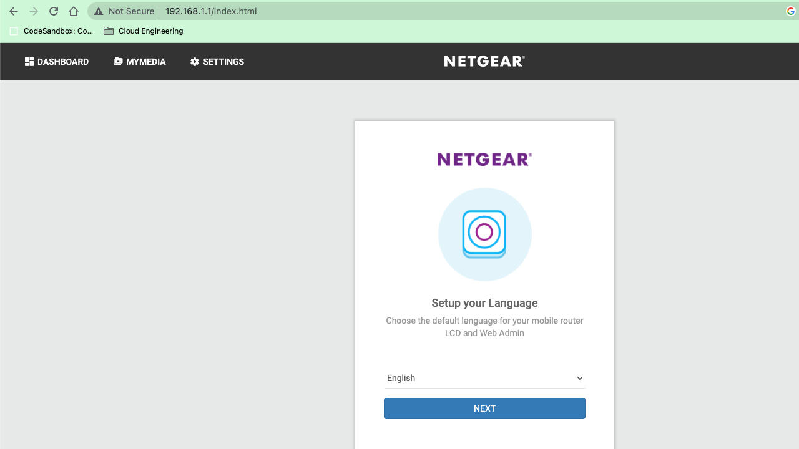
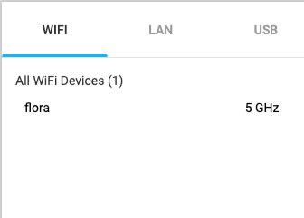
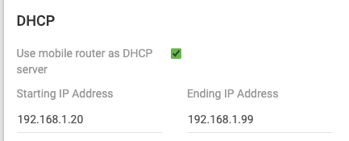

# **Network Devices**

# **Introductie:**

Er bestaat geen netwerk zonder netwerkapparatuur als je meer dan twee computers aan elkaar wilt schakelen.

Een korte, en zeker niet complete, lijst van netwerkapparatuur volgt:

- router
- switch
- repeaters
- access point

Elk apparaat in de lijst draagt eraan bij dat je data bezorgd wordt bij de juiste computer. En vaak zijn ze slim genoeg om samen te onderhandelen zodat jij, als gebruiker, geen zorgen hoeft te maken over de instellingen. Je netwerkapparaten blijven het doen zelfs als je computers toevoegt of verwijdert van je netwerk. Protocollen spelen hierin een belangrijke rol.

Implementaties van netwerkapparatuur kunnen ook verschillen: er bestaan meerdere vormen van een switch die werken op verschillende lagen van het OSI-model.

AWS en Azure bieden diensten aan die gelijk zijn aan wat netwerkapparatuur doen. En ieder netwerkconcept (routing, switching, gateways) heeft één of meerdere cloud equivalenten.

# **Bestudeer:**

- Netwerkapparaten
- Het OSI model in relatie tot deze netwerkapparaten

# **Benodigdheden:**

- Je eigen netwerk
- Admin toegangsgegevens voor je router
- **NOOT: Als je geen admin-toegang hebt, bijvoorbeeld omdat je in een appartementencomplex met gedeelde wifi woont, neem dan via Zoom het scherm over van een teamgenoot, en doe zo de opdracht.**

# **Opdracht:**

- Benoem en beschrijf de functies van veel voorkomend netwerkapparatuur
- De meeste routers hebben een overzicht van alle verbonden apparaten, vind deze lijst. Welke andere informatie heeft de router over aangesloten apparatuur?
- Waar staat je DHCP server op jouw netwerk? Wat zijn de configuraties hiervan?

# Onderwerp

---

*[Geef een korte beschrijving van het onderwerp]*

- 

## Key-terms

*[Schrijf hier een lijst met belangrijke termen met eventueel een korte uitleg.]*

Router

Switch

Modem

AP

Firewall

Switch

IP-adres

Mac-adres

## Opdracht

---

### Benoem en beschrijf de functies van veel voorkomend netwerkapparatuur

- `Router:` Een apparaat dat gegevenspakketten tussen computernetwerken doorstuurt en verschillende netwerken met elkaar verbindt. Het kan ook beveiligingsfuncties bevatten, zoals firewalls, om het netwerk te beschermen.
- `Switch:` Een apparaat dat netwerkverkeer binnen een lokaal netwerk stuurt op basis van het MAC-adres van het apparaat. Het biedt meerdere poorten om apparaten op het netwerk aan te sluiten en heeft doorgaans hogere doorvoersnelheden dan een router.
- `Modem:` Een apparaat dat digitale signalen omzet in een vorm die kan worden verzonden via telefoon- of kabelverbindingen. Het maakt verbinding met internetproviders en zorgt voor communicatie tussen het lokale netwerk en het bredere internet.
- `Access Point:` Een apparaat dat een draadloos LAN creëert of uitbreidt. Het ontvangt gegevens van bedrade apparaten en zet ze om in radiosignalen, zodat draadloze apparaten verbinding kunnen maken met het netwerk.
- `Firewall:` Een beveiligingsapparaat of software die ongeautoriseerd netwerkverkeer blokkeert en het netwerk beschermt tegen aanvallen. Het controleert inkomend en uitgaand verkeer op basis van regels en kan bepaalde websites, applicaties of services blokkeren.
- `Network Switch:` Een switch geoptimaliseerd voor grotere netwerken, met meerdere poorten om apparaten aan te sluiten. Het biedt geavanceerde functies zoals VLAN's, QoS en linkaggregatie voor efficiënte datatransmissie.

### De meeste routers hebben een overzicht van alle verbonden apparaten, vind deze lijst. Welke andere informatie heeft de router over aangesloten apparatuur?

- `Apparaatnaam:` De router kan de naam of het hostname van het aangesloten apparaat tonen, zoals de naam van een computer, smartphone of printer. Dit kan handig zijn om apparaten te identificeren.
- `IP-adres:` Routers tonen vaak het IP-adres dat aan elk aangesloten apparaat is toegewezen. Dit adres wordt gebruikt om gegevens tussen apparaten in het netwerk te verzenden.
- `MAC-adres:` Het MAC-adres (Media Access Control) is een uniek identificatienummer dat aan elk netwerkapparaat is toegewezen. Routers kunnen het MAC-adres van aangesloten apparaten weergeven, wat nuttig kan zijn voor het identificeren van specifieke apparaten op het netwerk.
- `Verbindingsstatus:` Een router kan aangeven of een apparaat momenteel actief is en verbonden is met het netwerk of niet. Dit kan handig zijn om te controleren welke apparaten online zijn.
- `Verbindingstype:` Routers kunnen aangeven welk type verbinding elk apparaat gebruikt, zoals bekabeld (Ethernet) of draadloos (Wi-Fi). Dit kan helpen bij het beheren van het netwerk en het identificeren van de gebruikte technologieën.
- `Gegevensgebruik:` Sommige routers bieden mogelijk ook informatie over het gegevensgebruik van elk aangesloten apparaat. Dit kan u inzicht geven in hoeveel gegevens elk apparaat verbruikt en kan handig zijn bij het monitoren van het netwerkverkeer.

### Waar staat je DHCP server op jouw netwerk? Wat zijn de configuraties hiervan?
inloggen via IP adress

Tab connected devices

DHCP settings (Router kan ook zonder DHCP worden ingesteld maar staat momenteel op manual)
In theorie kan ik met deze settings 79 devices met een static ip adres kunnen verbinden maar niet meer dan 20 tergelijk omdat dit het limiet is van de nighthawkm1

---

### Gebruikte bronnen

*[Plaats hier de bronnen die je hebt gebruikt.]*

https://www.cloudflare.com/en-gb/

https://www.geeksforgeeks.org/computer-network-tutorials/

### Ervaren problemen

*[Geef een korte beschrijving van de problemen waar je tegenaan bent gelopen met je gevonden oplossing.]*

Ik kan niet bij de instellingen van mijn router.

Ik heb een nighthawkm1 en die heb ik gebruikt voor de opdracht.

Helaas lukte het me niet om de data op mijn simkaart te zetten omdat ik niet de juiste simkaart kon vinden waar ik via KPN MBs mee kan delen.

Uiteindelijk heb ik toch kunnen verbinden met de router maar dan zonder internet en zo heb ik de opdracht kunnen maken.

### Resultaat

*[Omschrijf hoe je weet dat je opdracht gelukt is (gebruik screenshots waar nodig).]*

Devicelist & DHCP settings (Manual) kunnen bekijken van mijn nighthawk portable router.