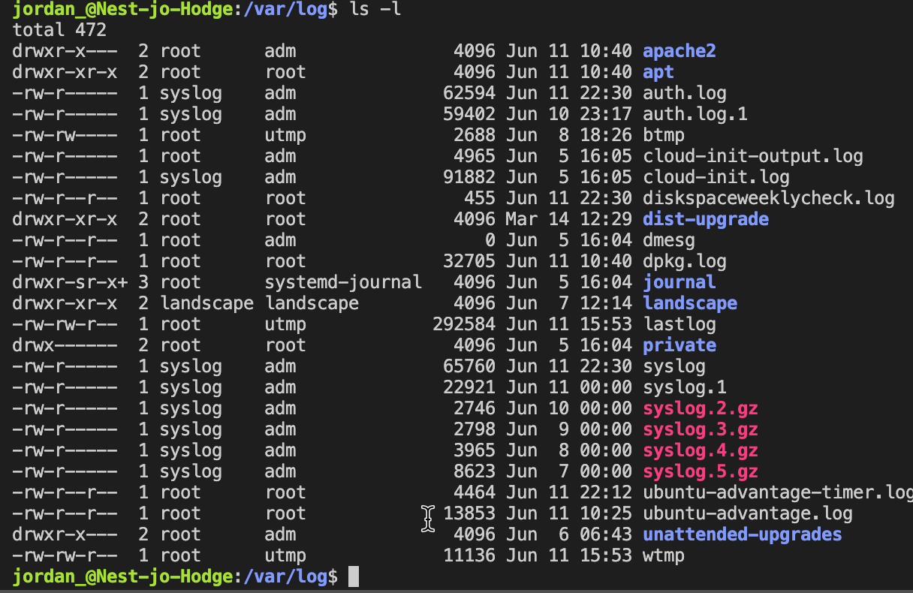

# [Cron Jobs]
There might be processes that you want to execute on a regular schedule. For example, you might want to write the available disk space to a log file every hour. Or maybe you want to check for system updates every 2nd day of the month.

These kinds of jobs can be automated using Cron jobs.

## Key-terms
[Schrijf hier een lijst met belangrijke termen met eventueel een korte uitleg.]

## Opdracht

# **Exercise:**

### Create a Bash script that writes the current date and time to a file in your home directory.

1. Eerst gaan we beginnen met het aanmaken van het script in de file `cronscriptinput.sh`
2. hierin zetten we de variable date en gebruiken we deze als output.

### Register the script in your crontab so that it runs every minute.

1. Om elke minut het script te laten runnen moeten we dit aangeven in de tijd en date die gebruikt wordt door cron.
Ook moeten we de naam van het script in onze cronjob vermelden.
2. Vervolgens moeten we 

### Create a script that writes available disk space to a log file in ‘/var/logs’. Use a cron job so that it runs weekly.
1. om te kunnen zien hoeveel ruimte er is op een disk zoals onze main disk kunnen we de `df` command gebruiken. in combinatie met een pipe en het path krijgen we de informatie waar we naar opzoek zijn.

~~~
df -h | grep /dev/root
~~~

2. vevolgens gaan we een nieuw script aanmaken met nano. hierna moeten we in crontab de juiste tijd aangeven. omdat het nu bijna 23:15 is op zondag gaan we deze tijd erin zetten het m h * * 0 15 minuten 23 uur maand en dag van de maand doen we niet en dan een 0 voor zondag want 0 = zondag en 6 is zaterdag.

`/var/log/diskspaceweeklycheck.log`

geen permission voor var/log

dit betekend dat ik het script moet runnen als sudo

~~~
30 22 * * 0 sudo /home/jordan_/scripts/diskspaceweeklycheck.sh
~~~

Het werk nogsteeds niet misschien is er iets mis met mijn print naar de log zelf
/var/log/diskspaceweeklycheck.log
### Gebruikte bronnen
[Plaats hier de bronnen die je hebt gebruikt.]

### Ervaren problemen
[Geef een ko rte beschrijving van de problemen waar je tegenaan bent gelopen met je gevonden oplossing.]
- ik had een fout gemaakt in het absolute path in crontab waardoor hij het script niet kon vinden.
- Wanneer ik het script zelf uitvoerde voegde die wel diskspaceweeklycheck.log toe aan var/log maar via cron niet. het duurde lang voordat ik hier over kwam en heb veel dingen geprobeerd om dit op te lossen.
- Het lijkt me persoonlijk geen goed idee om sudo scripts te draaien maar omdat het de opdracht is ben ik er mee door gegaan. ik had zelf eerder een log file in een eigen map gemaakt.

Verder had ik de UTC tijd verkeerd
### Resultaat
[Omschrijf hoe je weet dat je opdracht gelukt is (gebruik screenshots waar nodig).]
