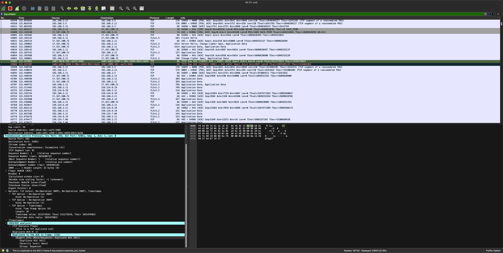
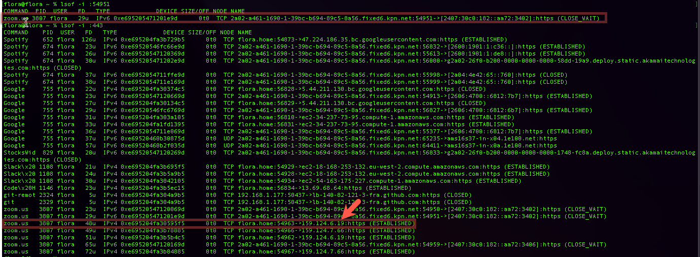
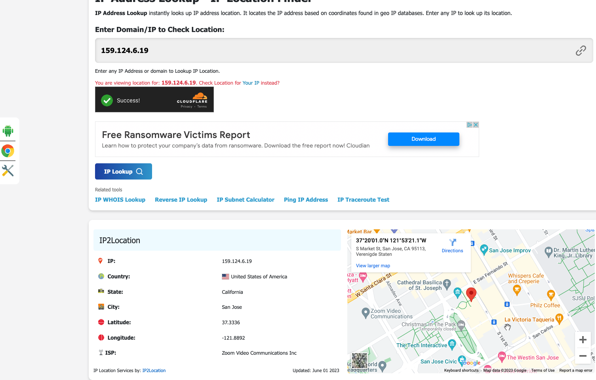

# **Protocols**

# **Introduction:**

A network protocol is an agreement about how to communicate. There are protocols on every layer of the OSI stack.

The layer 4 protocols, TCP and UDP, are responsible for transporting internet packets. UDP utilises a ‘fire and forget’ strategy, whereas TCP utilises a ‘Three-way handshake’. TCP is therefore more reliable, but UDP is significantly faster.

Protocols in higher layers, like HTTPS and SSH, all have their own use cases. Most of these protocols have a default port number.

# **Requirements:**

- Wireshark

# **Exercise :**

- Identify several other protocols and their associated OSI layer. Name at least one for each layer.
- Figure out who determines what protocols we use and what is needed to introduce your own protocol.
- Look into wireshark and install this program. Try and capture a bit of your own network data. Search for a protocol you know and try to understand how it functions.

# Protocols

---

*[Geef een korte beschrijving van het onderwerp]*

A network protocol is an agreement about how to communicate. There are protocols on every layer of the OSI stack.

The layer 4 protocols, TCP and UDP, are responsible for transporting internet packets. UDP utilises a ‘fire and forget’ strategy, whereas TCP utilises a ‘Three-way handshake’. TCP is therefore more reliable, but UDP is significantly faster.

Protocols in higher layers, like HTTPS and SSH, all have their own use cases. Most of these protocols have a default port number.

## Key-terms

*[Schrijf hier een lijst met belangrijke termen met eventueel een korte uitleg.]*

TCP

UDP

SSH

HTTPS

## Opdracht

---

### Identify several other protocols and their associated OSI layer. Name at least one for each layer.

1 → Please Do Not Throw Sweet Pizza Away → 7

1. Physical Layer:
    - Ethernet: Een protocol voor bekabelde lokale netwerken (LAN's).
2. Data Link Layer:
    - ARP (Address Resolution Protocol): Vertaalt IP-adressen naar MAC-adressen.
    - PPP (Point-to-Point Protocol): Gebruikt voor directe verbindingen tussen knooppunten.
3. Network Layer:
    - IP (Internet Protocol): Beheert adressering en routering van netwerkpakketten.
    - ICMP (Internet Control Message Protocol): Gebruikt voor netwerkdiagnostiek en foutrapportage.
4. Transport Layer:
    - TCP (Transmission Control Protocol): Biedt betrouwbare, verbindinggeoriënteerde communicatie.
    - UDP (User Datagram Protocol): Biedt snelle, verbindingloze communicatie.
5. Session Layer:
    - NetBIOS (Network Basic Input/Output System): Beheert sessieopbouw en -afsluiting.
6. Presentation Layer:
    - MIME (Multipurpose Internet Mail Extensions): Definieert niet-tekst e-mailbijlagen.
7. Application Layer:
    - DNS (Domain Name System): Vertaalt domeinnamen naar IP-adressen.
    - HTTP (Hypertext Transfer Protocol): Verzendt webpagina's en bronnen.
    - FTP (File Transfer Protocol): Vergemakkelijkt bestandsoverdracht tussen clients en servers.
    - SMTP (Simple Mail Transfer Protocol): Verstuurt e-mailberichten tussen servers.

TCP/IP: (3)Network Layer (4)Transport 

SSL/TLS (Secure Sockets Layer/Transport Layer Security): (4)Transport & (6)Presentation Layer

HTTP/HTTPS: (7)Application (4)Transport (6)Presentation

### Figure out who determines what protocols we use and what is needed to introduce your own protocol.

Het protocol dat wordt gebruikt bij het verzenden van netwerkverkeer wordt doorgaans bepaald door de applicatie of dienst die de communicatie initieert. De keuze van het protocol hangt af van verschillende factoren, waaronder het beoogde doel van de communicatie, de vereisten van de applicatie en de netwerkinfrastructuur.

Bijvoorbeeld:

Webbrowsers gebruiken HTTP- of HTTPS-protocollen om te communiceren met webservers.
E-mailclients gebruiken protocollen zoals SMTP voor het verzenden van e-mails en POP3 of IMAP voor het ontvangen van e-mails.
Toepassingen voor bestandsoverdracht kunnen gebruikmaken van protocollen zoals FTP of SFTP.
Applicaties voor spraak- en video-communicatie gebruiken vaak protocollen zoals SIP of RTP.

### Look into Wireshark and install this program. Try and capture a bit of your own network data. Search for a protocol you know and try to understand how it functions.

1. TCP Error opgezocht in wireshark om te proberen te zien wat hier nu gebeurd

2. Hierna heb ik gekeken welke applicatie hoort bij het poort nummer 54951

3. In de terminal heb ik met de volgende command `lsof -i :54951

4. hier zag ik dat zoom de applicatie was. als laatste heb ik het ip adress van zoom opgezocht en zag dat dit in america was en hier kan ik dus zeggen dat er iets mis gaat in de TCP tussen mijn internet en zoom.

5. Wat dit nu precies betekend is mij nog niet duidelijk. Mijn conclusie is dat er drops in audio of video zijn omdat we met meerdere mensen in een call zitten en het verwisselen van de kwaliteit ervoor zorgt dat ik in wiresharp duplicate ACKs zie.

## ChatGPT geeft de volgende uitleg:

Wanneer er duplicaat-acknowledgements (ACKs) binnen TCP zijn, duidt dit meestal op pakketverlies of netwerkcongestie. Hier zijn enkele mogelijke scenario's en hun implicaties:

`Pakketverlies:` Duplicaat-ACKs kunnen voorkomen wanneer een TCP-zender geen bevestiging ontvangt voor een verzonden pakket binnen een bepaalde tijdsperiode. Als reactie daarop stuurt de zender het pakket opnieuw, maar het oorspronkelijke pakket wordt uiteindelijk afgeleverd en erkend. Dit resulteert in duplicaat-ACKs die door de ontvanger worden verzonden. De aanwezigheid van duplicaat-ACKs suggereert dat sommige pakketten verloren zijn gegaan of in een verkeerde volgorde zijn aangekomen.

`Levering in verkeerde volgorde:` In sommige gevallen kunnen TCP-pakketten in een verkeerde volgorde bij de ontvanger aankomen als gevolg van verschillende netwerkpaden of routeringsproblemen. Wanneer dit gebeurt, kan de ontvanger duplicaat-ACKs genereren voor pakketten die het al heeft ontvangen om de zender te signaleren dat er een hiaat zit in de ontvangen volgorde.

`Netwerkcongestie:` Hoge netwerkcongestie kan vertragingen en pakketverlies veroorzaken. Wanneer congestie optreedt, treedt TCP's congestiebeheermechanisme in werking, wat leidt tot retransmissies en het genereren van duplicaat-ACKs. De zender kan meerdere ACKs ontvangen voor hetzelfde sequentienummer, wat aangeeft dat de ontvanger nog steeds wacht op een ontbrekend pakket.

Het is belangrijk op te merken dat niet alle duplicaat-ACKs wijzen op ernstige netwerkproblemen. In sommige gevallen kunnen ze normaal gedrag zijn wanneer TCP zich aanpast aan veranderende netwerkcondities. Als duplicaat-ACKs echter aanhouden of vaak voorkomen, kan dit duiden op een probleem dat moet worden onderzocht, zoals netwerkcongestie, pakketverlies of een onjuiste netwerkconfiguratie.

## Bronnen
https://www.youtube.com/watch?v=RTJLbXEqBhM

https://www.youtube.com/watch?v=Hq-nOMEPh4U