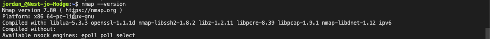
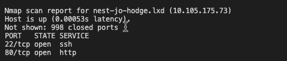
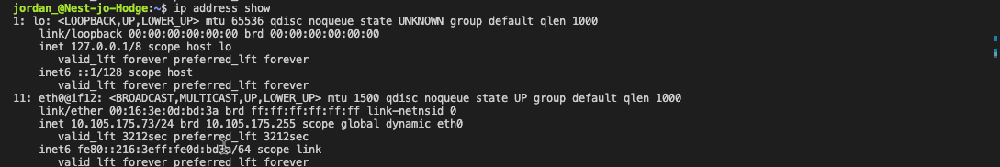
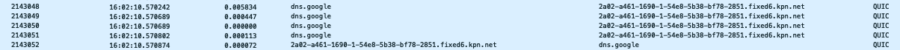
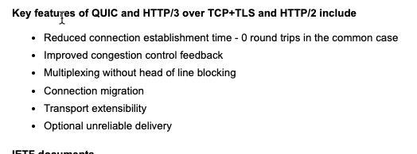

# [Network detection]
[Geef een korte beschrijving van het onderwerp]
In order to prevent or stop attacks on a network, you must be able to analyse your network.

To do this we need tools that can help us with this job.
Two popular tools for this are
- Nmap  
**(Network Mapper) is a tool that scans a network to find information about it. For example, what ports are open in a host in your network.**

- Wireshark  
**Wireshark is a protocol analyzer. It looks at network traffic and shows information about packets like protocol and destination (among other things).**

## Key-terms
- Network
- Ports
- Traffic
- Packets
- Protocols
- Host

## Opdracht
### Scan the network of your Linux machine using nmap. What do you find?
We gaan beginnen met het checken van updates voor onze linux vm
~~~
sudo apt-get update
apt-get upgrade
~~~
Hierna gaan we Nmap installeren
~~~
sudo apt-get install nmap
~~~
Nu gaan we testen of het gelukt is.
~~~
nmap -V
~~~

Om nmap te gebruiken om een IP address te scannen kunnen we de volgende command gebruiken.
~~~
nmap <ipadress>
sudo nmap <ipadress>ip
~~~

## Open Wireshark in Windows/MacOS Machine. Analyse what happens when you open an internet browser.
*(Tip: you will find that Zoom is constantly sending packets over the network. You can either turn off Zoom for a minute, or look for the packets sent by the browser between the packets sent by Zoom.)*

### Gebruikte bronnen
[Plaats hier de bronnen die je hebt gebruikt.]

### Ervaren problemen
[Geef een korte beschrijving van de problemen waar je tegenaan bent gelopen met je gevonden oplossing.]

### Resultaat
[Omschrijf hoe je weet dat je opdracht gelukt is (gebruik screenshots waar nodig).]
