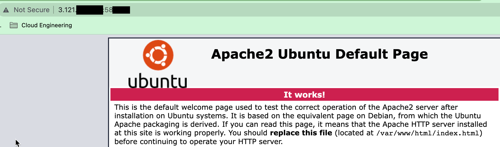

# [Firewalls]
[Geef een korte beschrijving van het onderwerp]

Firewalls

## Key-terms
[Schrijf hier een lijst met belangrijke termen met eventueel een korte uitleg.]

# Opdracht
## Installeer een webserver op je VM.

We hebben apache2 op onze server staan dus we gaan kijken of die nog actief is.
~~~
sudo systemctl status apache2
~~~
De service is gestart dus nu gaan kijk wat de standaardpagina is die met de webserver geinstalleerd is.
In een eerdere opdracht hebben we al ontdekt wat het ip van onze VM is maar we kunnen dit nog een keer nalopen.
~~~
nmap 10.105.175.73
~~~
Nu kunnen we in de browser naar onze webserver `10.105.175.73`

## Bekijk de standaardpagina die met de webserver geïnstalleerd is.

Dit lukt momenteel niet connection timed out, dit kan te maken hebben met onze firewall

## Stel de firewall zo in dat je webverkeer blokkeert, maar wel ssh-verkeer toelaat.

~~~
sudo ufw allow ssh
~~~
We gaan nu kijken via welke port ssh verbindingen gaan zodat we niet de port blokkeren om zelf in onze vm te komen
~~~
sudo nano /etc/ssh/sshd_config
~~~

Nu gaan we op zoek naar de port die gebruikt wordt door de apache2 webserver

~~~
sudo nano /etc/apache2/apache2.conf
~~~
Hier staat het niet in.
Het lijkt erop dat de standaard port nummer 80 is.
Nu ik port 80 open heb gezet zou ik verwachten dat webverkeer wel mogelijk is.
We hebben hiervoor het public IP adress nodig van de server

~~~
curl ifconfig.me
~~~
~~~
3.121.130.219
jordan_@Nest-jo-Hodge:~$ 
~~~
Het werkt niet dus er staat nog duidelijk iets niet goed
Laten we eens gaan kijken wat er gebeurd als we alles open zetten.

Hij werkt nog niet we gaan nu controlleren of het poort nummer wel klopt
De SSH poort is 52---
De Web Poort is 58---

Via de Web Poort lukt het wel om bij de webserver te komen

Als laatste gaan we poort 80 blokkeren
Daarna herstarten we de firewall om de verandering actief te maken.

~~~
sudo ufw deny 80
&
sudo service ufw restart
~~~

## Controleer of de firewall zijn werk doet.
We kunnen niet meer verbinden met de webserver

### Gebruikte bronnen
[Plaats hier de bronnen die je hebt gebruikt.]

### Ervaren problemen
[Geef een korte beschrijving van de problemen waar je tegenaan bent gelopen met je gevonden oplossing.]
Ik had de verkeerde poort voor de webserver namelijk dezelfde als de ssh poort
Het duurde erg lang voordat ik hier achter kwam.
Hierdoor heb ik wel heel veel dingen geprobeerd en geleerd dus dat is mooi.
Na het gebruiken van het juiste poort nummer was de opdracht snel gemaakt

### Resultaat
[Omschrijf hoe je weet dat je opdracht gelukt is (gebruik screenshots waar nodig).]
