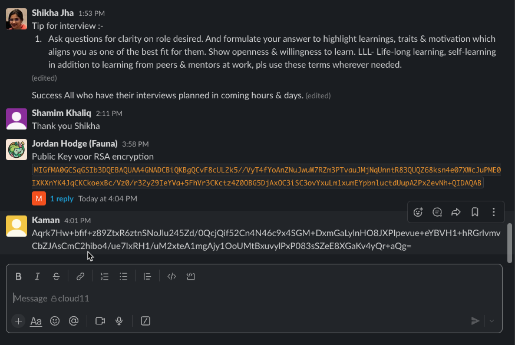
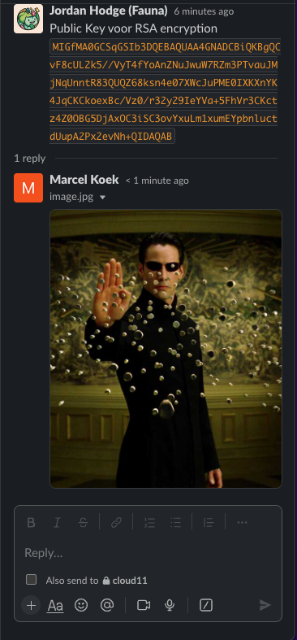

# [Asymmetric encryption]
[Geef een korte beschrijving van het onderwerp]
Asymmetric encryption

Introduction:
The previous assignment introduced you to cryptography and symmetric encryption. In the previous exercise, you shared your encryption key with the recipient of your message. This means that anyone who has the key can decrypt the message.

Asymmetric encryption solves this issue. Instead of 1 key, you get 2: A public key, and a private key.

## Key-terms
[Schrijf hier een lijst met belangrijke termen met eventueel een korte uitleg.]

Asymmetric encryption

## Opdracht

### Gebruikte bronnen

Asymmetric    
https://www.youtube.com/watch?v=AQDCe585Lnc  
RSA  
https://www.youtube.com/watch?v=Pq8gNbvfaoM  
Hashing vs Encryption Differences  
https://www.youtube.com/watch?v=GI790E1JMgw

## Pair Key Generator
https://www.devglan.com/online-tools/rsa-encryption-decryption

## Public
MIGfMA0GCSqGSIb3DQEBAQUAA4GNADCBiQKBgQCvF8cUL2k5//VyT4fYoAnZNuJwuW7RZm3PTvauJMjNqUnntR83QUQZ68ksn4e07XWcJuPME0IXKXnYK4JqCKCkoexBc/Vz0/r32y29IeYVa+5FhVr3CKctz4Z0OBG5DjAxOC3iSC3ovYxuLm1xumEYpbnluctdUupA2Px2evNh+QIDAQAB

## Private
MIICdQIBADANBgkqhkiG9w0BAQEFAASCAl8wggJbAgEAAoGBAK8XxxQvaTn/9XJPh9igCdk24nC5btFmbc9O9q4kyM2pSee1HzdBRBnrySyfh7TtdZwm48wTQhcpedgrgmoIoKSh7EFz9XPT+vfbLb0h5hVr7kWFWvcIpy3PhnQ4EbkOMDE4LeJILei9jG4ubXG6YRilueW5y11S6kDY/HZ682H5AgMBAAECgYAGhuFh7D6E7fitUS+kMJsNYNFiGFd8MNBJGQ1zAmYF3JinrYXDXoh2Wua95hh98xgeQQje05z0FhS3rS+IWlf6mybD8QEU84xs9zcdZpcOA4fl7m30vbFMrCAG+ekn04rif04XkCEFVu7BNr4qKDSVROOQWuZSYJX0N5EVc96HfQJBAPT1ZePxYd7q25z8iKnbSowp0EDfuqwvNfspwQWEs3/Pc/nl12RsFC6Tuiotg8Id+LmPSEHrveRDR43PW3Co5L8CQQC2/DEzEMEZR83l84Y8Q7wJlmg9Q0KvdRm8mz+fGUHXcjwfhDSSltFQnK7UbRqtDQD10xcvSdmZlMLafwx6u09HAkAeG3dNf+KOmoEpl2RYtCpCdfUxtA3mkdrppuUhf4DsaZwQj+5cWmhUnTWZb4StPC/Q5spzx7zMLHTD+kN74lZTAkArQJNUkbpDAoD9wMFTD2OsFHxRNsvVc2WA+mVgcvToOx1RCcvvdmzFlDOTDLMIgpFeieXqDJe9wLcKNIu7mvjTAkAMzC7f7hemKFpSP7DS09KEH8orp534EX/ALHKryxCU/EF+q5/dv/fxHfwd8XSa7E2VYzP0Tc22fewl/nEkiYwC

## Encrypted Output
hJVHltiFQ2BCrGJsA2GpYNBIvarqK6DBZh9uC28CJNv3kw0l/bg2I2pGtzkxRjQgnDGigSEN7AIiVO73giBFJwz1g8V8dL9ZgiRzwBWPmOfTCZpHXfF273lq3jiDtD58E2aakGUYQ4cJEYheh5oCnvvHdt4KHl1kHJ+B1l1IaEQ=

## Public Key Shared in Cloud 11 Slack 

## Shared Private Key in our team group Breaking Byte

## Response From Team member

### Ervaren problemen
[Geef een korte beschrijving van de problemen waar je tegenaan bent gelopen met je gevonden oplossing.]
Dit ging een stuk makkelijker dan opdracht 4 doordat er veel betere asymmetric tools waren dan symmetric

### Resultaat
[Omschrijf hoe je weet dat je opdracht gelukt is (gebruik screenshots waar nodig).]
