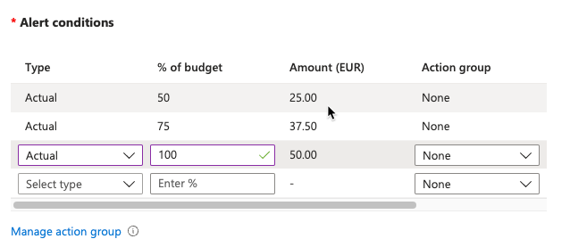

# [Cost Management + Billing]

Een veelgenoemd voordeel van de cloud is dat je alleen betaalt voor wat je gebruikt. Het gaat hier om OPEX in plaats van CAPEX uitgaven. De “Cost Management + Billing” tool geeft inzicht in je uitgaven in Azure en stelt je in staat je subscriptions te beheren.

Wanneer je een ‘Free Account’ of een ‘Student Account’ aanmaakt krijg je een bedrag van Microsoft cadeau om in Azure mee te experimenteren. Houd er rekening mee dat na 30 dagen je subscription automatisch stop wordt gezet, waardoor al je nog draaiende diensten uitgezet worden.

Als je een ‘Pay-as-you-go’ subscription heb aangemaakt zijn er een aantal diensten die tot op zekere hoogte altijd gratis zijn. Begrijp wel dat deze diensten soms geïntegreerd zijn met andere diensten waar je wel voor moet betalen. 

Azure heeft de volgende principes om succesvol je kosten te reduceren:
Plan (Planning)
Zichtbaarheid (Visibility)
Verantwoording (Accountability)
Optimalisatie (Optimization)
Iteratie (Iteration)

De Total Cost of Ownership (TCO) wordt gebruikt om te berekenen hoeveel een infrastructuur kost als het op de traditionele manier gehost wordt. Met de TCO-calculator kan je de kosten van een traditionele infrastructuur vergelijken met de kosten voor dezelfde infrastructuur op Azure.

## Key-terms

[Schrijf hier een lijst met belangrijke termen met eventueel een korte uitleg.]

## Study

### De Azure principes voor kostenmanagement
### De voorwaarden van de ‘Free subscription’
### Het verschil tussen CAPEX en OPEX.
### De TCO-calculator

## Opdracht

### Maak een alert aan waarmee je eigen kosten kan monitoren.

### Begrijp de opties die Azure aanbiedt om je uitgaven in te zien.
Er zijn verschillende manieren om dit te doen
- Cost analysis
- Budgets
- Billing

### Gebruikte bronnen
https://www.youtube.com/watch?v=mQYR7icumaU

### Ervaren problemen
[Geef een korte beschrijving van de problemen waar je tegenaan bent gelopen met je gevonden oplossing.]

### Resultaat
[Omschrijf hoe je weet dat je opdracht gelukt is (gebruik screenshots waar nodig).]
