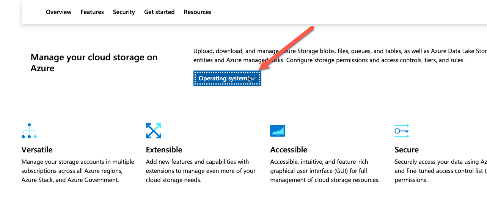
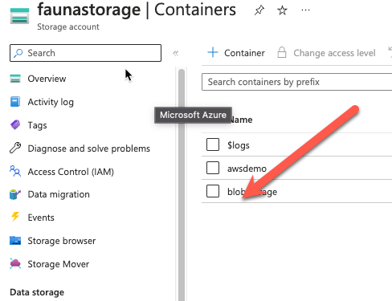
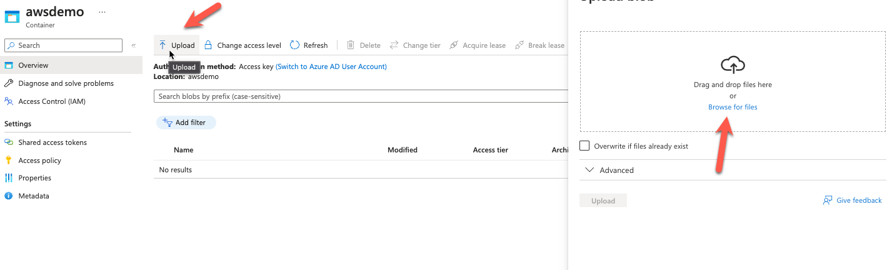
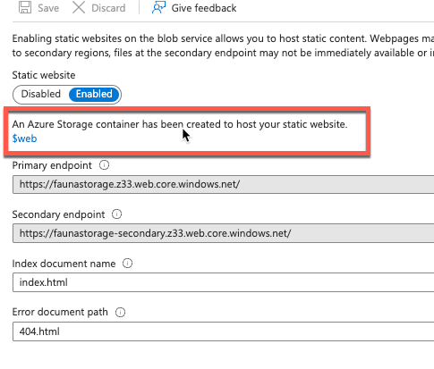
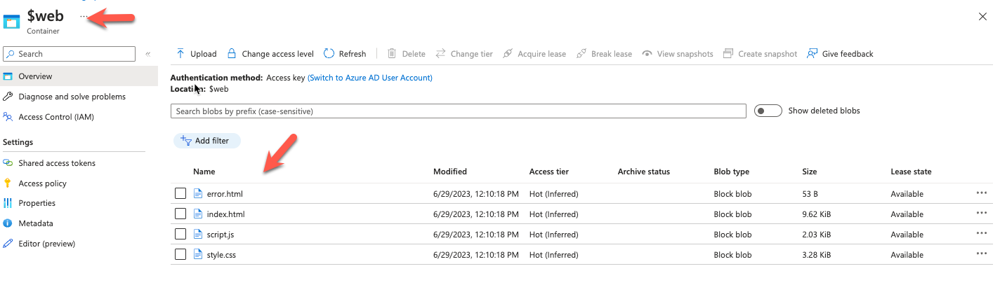
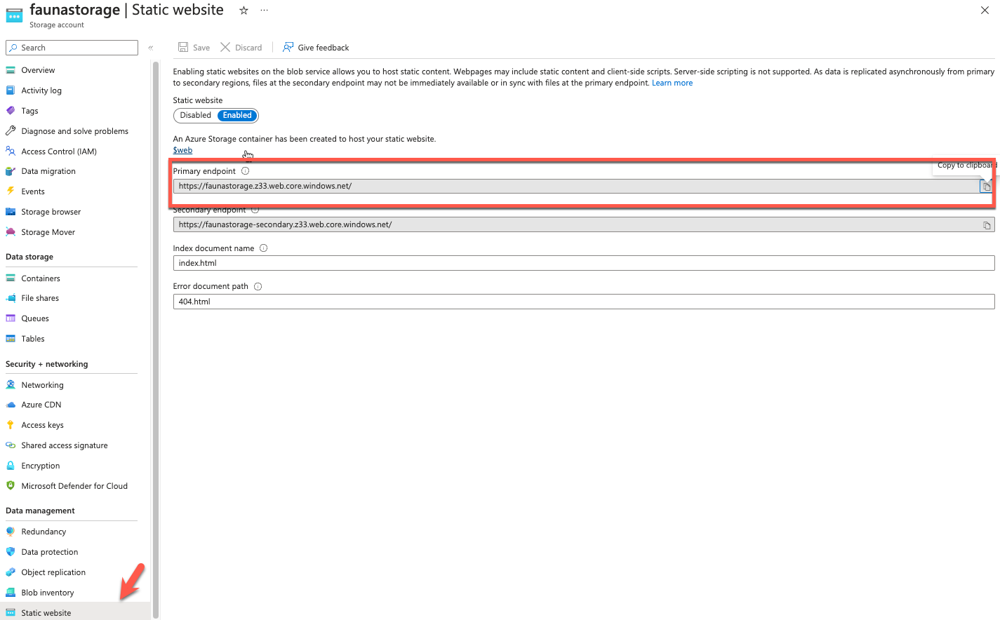
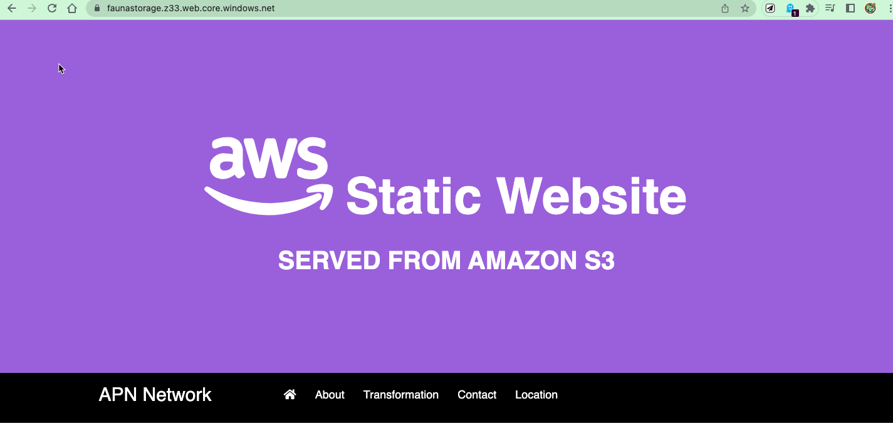

# [Azure Storage Account]
Om data op te slaan in Azure heb je een Azure Storage Account nodig. In een Storage Account staan alle Azure Storage data objects als blobs, files, disks en tables.

Data in een Storage Account is secure, highly available, durable en massively scalable. Alle data in een Storage Account is bereikbaar via het internet met HTTP en HTTPS. Omdat het makkelijk te bereiken is moet je goed opletten dat alleen de juiste identiteiten permissies hebben om bij de data te komen.

Azure Storage explorer is een gratis GUI om je data te beheren in Azure.

Veel IaaS en PaaS services van Azure maken ook gebruik van Azure Storage Accounts.

Naast het opslaan van data kan Blob Storage ook gebruikt worden voor het hosten van statische websites.

## Key-terms
Blob Binary Large OBject - file
File - Shared drive protocols
Table - 
Queue Storage - Storage for small pieces of data (Messages)
Disk - 

Structured Data
Semi-Structured
Unstructured

Three storage tiers
- Hot - frequently accessed data
- Cool - infrequently accessed data
- Archive - rarely (if-ever) accessed data

## Opdracht 1
### Maak een Azure Storage Account. Zorg dat alleen jij toegang hebt tot de data.
- We gaan beginnen met het aanmaken van een azure storage account.
- We kiezen hierbij voor de volgende opties

### Plaats data in een storage service naar keuze via de console (bijvoorbeeld een kattenfoto in Blob storage).
1. Go to the Azure portal (https://portal.azure.com) and sign in to your Azure account.
2. Navigate to the storage account you created by searching for "Storage accounts" in the search bar at the top.
3. Click on the name of your storage account to open its overview page.
4. In the left-hand menu, under the "Data service" section, click on "Containers."
5. On the Containers page, click on the "+ Container" button to create a new container.
6. Provide a unique name for the container (cloudcontainer11), choose its access type (e.g., private, public), and configure any additional settings as needed. Then click on "Create" to create the container.
7. Once the container is created, click on its name to open it. `See Problems`
8. In the container view, you will see the option to upload files or folders. You can either drag and drop files into the container or use the "Upload" button to browse and select files from your local machine.
9. Select the files you want to upload and click on "Upload" to start the upload process.
10. The files will be uploaded to the storage container, and you can monitor the progress in the Azure portal. Once the upload is complete, you can access and manage your data within the storage container.  

Upload

### Haal de data op naar je eigen computer door middel van de Azure Storage Explorer.
1. download file explorer
https://azure.microsoft.com/en-gb/products/storage/storage-explorer/
2. Sign in bij azure

3. vind je storage account

## Download

### Opdracht 2
#### Maak een nieuwe container aan.

#### Upload de 4 bestanden die samen de AWS Demo Website vormen.
- download de bestanden uit de map week 4 drive cloud 11

#### Zorg dat Static Website Hosting aan staat.
--> https://learn.microsoft.com/en-us/azure/storage/blobs/storage-blob-static-website-how-to?tabs=azure-portal
- We gaan hier naar de overview page van onze storage account
- Zorg voor een index en error .html file

- Vergeet niet op save te klikken

- nu hebben we een $web container
- Ik snap niet waarom de opdracht zegt maar een container aan als we later een speciale $webcontainer maken
- maargoed we gaan de files nog een keer uploaden en nu in onze $web container 

- Oke nu deleten we die eerder gemaakte awsdemo contrainer
- we gaan we de url opzoeken voor onze $webcontainer
https://faunastorage.blob.core.windows.net/$web
- hij werkt niet want we hebben geen public acces

- oke we moesten de link vanuit static website menu hebben 
https://faunastorage.z33.web.core.windows.net/

En hier is de website

- als die het niet doet voor jou dan voeg ik je IP adress toe aan de firewall stuur me maar een msg
#### Deel de URL met een teamgenoot. Zorg ervoor dat zij de website kunnen zien.
- Gedeeld met Shamim

### Gebruikte bronnen
https://www.youtube.com/watch?v=sI2ahWX8RH8
https://www.youtube.com/watch?v=Ya27vqnI_5A

https://learn.microsoft.com/en-gb/azure/storage/common/storage-network-security?tabs=azure-portal
https://learn.microsoft.com/en-us/azure/storage/blobs/storage-blob-static-website
### Ervaren problemen
1. Het lijkt erop dat ik geen toegang heb tot de contrainer die ik zojuist heb aangemaakt.
    We gaan uitzoeken waardoor dit komt
    
2. Ik weet niet zeker of met de console CLI wordt bedoeld of gewoon de Azure console

### Resultaat

