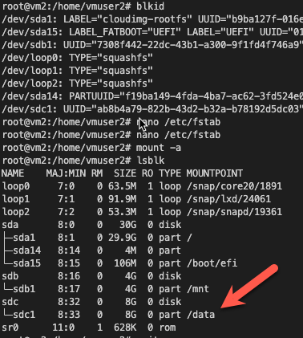
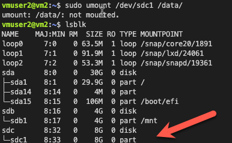
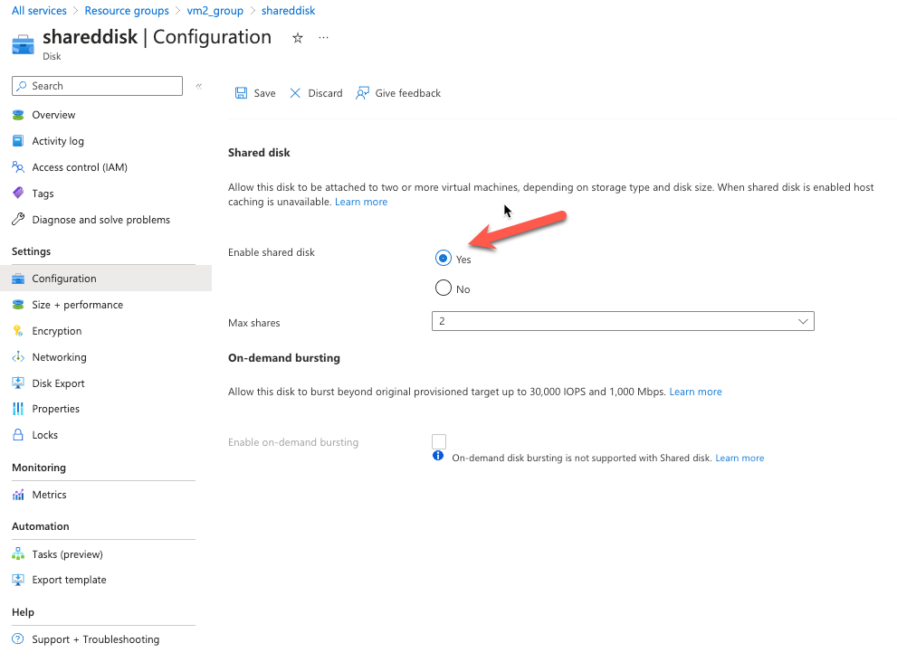
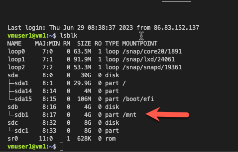
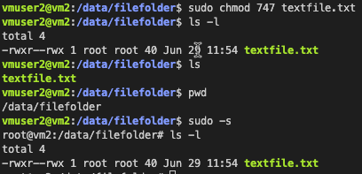
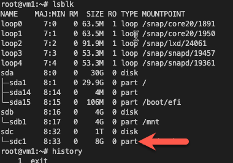
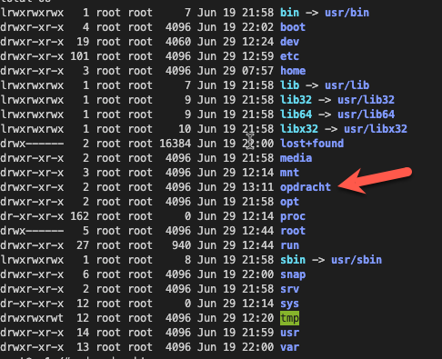
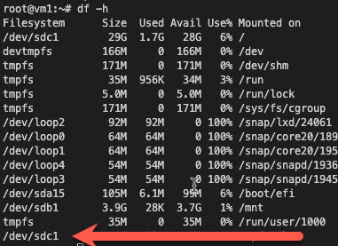
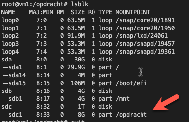

# [Azure Disk Storage]
Azure Disk Storage kan gezien worden als een virtual hard drive in de cloud. Een disk kan een OS disk (waar het OS op staat) of een Data Disk (te vergelijken met een externe harde schijf) zijn. Je hebt een keuze tussen Managed Disks en Unmanaged Disks. Unmanaged Disks zijn goedkoper, maar je hebt er wel een Storage Account nodig (en je moet de disk dus zelf managen). Managed Data Disks kunnen gedeeld worden tussen meerdere VMs, maar dat is een relatief nieuwe feature en er zitten wat haken en ogen aan.

## Key-terms

## Opdracht
- Start 2 Linux VMs. Zorgt dat je voor beide toegang hebt via SSH.
Done with default settings
- Maak een Azure Managed Disk aan en koppel deze aan beide VMs tegelijk.
VM -> Disk -> Attached disk
- Creëer op je eerste machine een bestand en plaats deze op de Shared Disk.
We moeten hiervoor eerst inloggen op onze 1ste VM
~~~
ssh -i ~/.ssh/AZ07virtual01_key.pem AZ07user01@20.68.136.33
~~~
Nu we ingelogd zijn gaan we opzoek naar de mounted disk die we hebben aangemaakt.
We gaan eerst onze disks listen 
~~~
dh -h
~~~
Hier zien we de `/mnt`
~~~
cd /mnt
sudo touch file.text
ls -l
~~~
- Nu zien we ons bestand en gaan we kijken of we deze ook kunnen vinden in onze 2de vm
- Nee dit kunnen we niet helaas
- We gaan een snapshot aanmaken zodat dit wel het geval is.
- Nu gaan we opnieuw inloggen op onze 2de VM

- Er is nog geen snapshot zichtbaar, misschien moeten we de snapshot eerst laden

- Kijk op de tweede machine of je het bestand kan lezen.
- Maak een snapshot van de schijf en probeer hier een nieuwe Disk mee te maken.
- Mount deze nieuwe Disk en bekijk het bestand.
- We hebben een snapshot gemaakt, nu gaan we een nieuwe shared disk maken en daar laden we de snapshot op.
- ook dit lijkt niet te werken.

- Dag 2 
- 2 nieuwe vms aangemaakt
- 1 nieuwe shared disk aangemaakt
- Nu gaan we de disk eerst formarteren
- We hebben de onze shared disk aan VM 2 vastgemaakt 
- Nu gaan we met de volgende commands de disk partitionen een filesystem toevoegen en mounten
~~~
#disk check
    lsblk
#root logging
    sudo -s
#onze shared disk (8gb)
    fdisk /dev/sdc
#view type
--> n
#select type
--> p
--> default
--> default
--> default
#view part
--> p
#alter table
--> w
#view disk
    lsblk
#formatting
    mkfs.ext4 /dev/sdc1
#create data directory
    mkdir /data
#mount filesystem
    mount /dev/sdc1 /data/
#list filesystem
    df -h
#ensure remount after reboot add to /etc/fstab
#copy sdc1 UID
    blkid
#edit /etc/fstab
#pasta UID
    UUID="ab8b4a79-822b-43d2-b32a-b78192d5dc03 /data ext4 defaults 0 0
#now we mount the filesystem
    mount -a
#see disks
    lsblk
#now we see that the disk is mounted

~~~

- nu we dit gedaan hebben voor on vm2 gaan we dit ook doen voor vm1
- We reloggen naar vm1
- we nemen hierbij de stappen net na het partitionen en voor het mounten
- eerst moeten we de disk toevoegen in azure portal 
- het blijkt dat ik geen shared disk heb geselecteerd bij het aanmaken van de 'shared disk'
- nu stop ik vm2 en ga ik kijken of ik de disk kan demounten en er een shared disk van kan maken. (Nee dit kan dus alleen via de command line via unmount [diskpath])
- Oke we moeten weer terug naar vm2 om hem via de command line the detachen
~~~
umount /dev/sdc1 /data/
~~~
- We doen nu even alleen unmounten en laten de automount in de etc/fstab staan en hopen dat we dan hem shared kunnen maken en niet opnieuw de UUID uit de /etc/fstab hoeven te halen en weer erin 

- Nu gaan we vm2 in azure portal stoppen en kijken of we de shared disk kunnen veranderen naar shared --> als dit niet lukt ga ik een nieuwe disk aanmaken die wel shared is. dat wilde ik in eerste instantie al doen maar ook wel goed om te weten of dit ook kan ivm data die er bijvoorbeeld al op staat --> we kunnen dan natuurlijk wel met een snapshot en een nieuwe disk de data bewaren maar dan moeten we de snapshot maken na het formarteren lijkt mij? of zou de snapshot al geformateerd zijn?
- oke het was een stuk simpeler dan ik dacht, ik moet hem van de vm afhalen in azure portal

- nu kunnen we hem wel veranderen naar shared

- Nu die op shared staat ga ik kijken of ik de rescource groups kan samenvoegen van vm1 en vm2 ik heb hier bij het aanmaken niet goed op gelet en ze hebben nu een andere rescourcegroup
- de rescources groups zijn nu samen gevoegd
- nu gaan we kijken of we een file kunnen maken en deze via de shared disk op biede vms kunnen zien
- De disk is zichtbaar 

- nu gaan we de disk mounten op vm1 net als bij vm2
- Het lijkt erop dat we niet dezelfde folder kunnen mounten op vm1 die we in vm2 hebben gemaakt
~~~
#we gaan eerst naar de root
sudo -s
#mount filesystem
    mount /dev/sdc1 /data/
#list filesystem
    df -h
#ensure remount after reboot add to /etc/fstab
#copy sdc1 UID
    blkid
#edit /etc/fstab
#pasta UID
    UUID=ab8b4a79-822b-43d2-b32a-b78192d5dc03 /data ext4 defaults 0 0
#now we mount the filesystem
    mount -a
#see disks
    lsblk
#now we see that the disk is mounted
~~~
- Dit lijkt ook niet te werken nu blijft er nog de optie over om een snapshot te maken met de file en deze te mounten op vm1
- We hebben nu op de disk in /data/filefolder een bestand textfile.txt gemaakt en we gaan nu kijken of we deze na een snapshot en een nieuwe disk aanmaken kunnen mounten op vm1
- Ik heb ook de permissions aangepast zodat het bestand wel door andere users gelezen kan worden maar niet geedit zodat er geen text ingezet kunnen worden vanuit de andere vm

- Ik heb de vorige disk verwijdert en nu de nieuwe shareddisk met de snapshot met de file attached aan vm1 in azure portal
- Nu moeten we de shareddisk gaan mounten hiervoor hebben we verschillende commands nodig
~~~
#we gaan eerst wisselen naar de root
sudo -s
#nu gaan we kijken waar onze schijf zich bevind
lsblk
#hij bevind zich op sdc1
~~~

- Onze volgende stap wordt om een directory te maken zodat we onze schrijf kunnen mounten
~~~
cd /
mkdir opdracht
~~~
 
 Vervolgens gaan we de disk mounten om te weten waar gebruiken we de volgende command
~~~
#filesystem
df -h
~~~

- Nu nemen we dit pad om in onze aangemaakte opdracht directory de schijf te mounten
~~~
mount /dev/sdc1 /opdracht
~~~
- Nu gaan we kijken of het gelukt is dit doen we wederom met `df -h`  

- Hierna gaan we naar de folder om te zien of onze file daar staat
~~~
#om uit de root te gaan
exit
#om naar onze map te gaan
cd /opdracht
#om te zien of onze folder van de shareddisk erstaat
ls -l
~~~

- Het is gelukt om het bestand te openen.

### Gebruikte bronnen
https://learn.microsoft.com/en-us/azure/virtual-machines/disks-types  
https://www.youtube.com/watch?v=f_9okkunX40  
https://learn.microsoft.com/en-us/azure/virtual-machines/linux/detach-disk  

https://learn.microsoft.com/en-us/answers/questions/445559/i-cannot-see-data-on-my-shared-disk-on-my-second-a

### Ervaren problemen
Double mount 
1st part en format
2de disk mount
ls bill om mount te zien

### Resultaat
[Omschrijf hoe je weet dat je opdracht gelukt is (gebruik screenshots waar nodig).]
