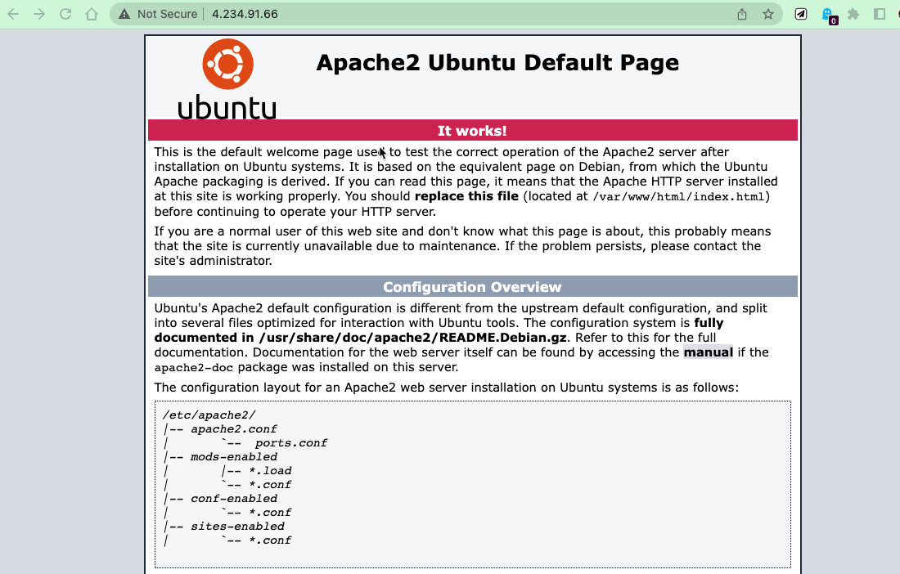
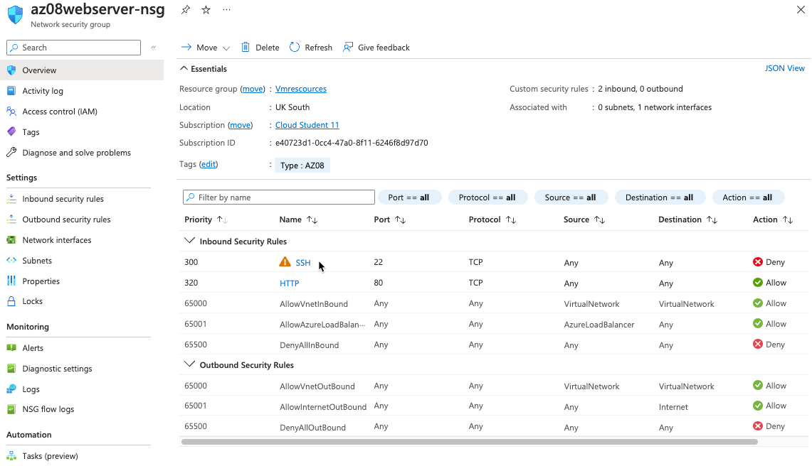
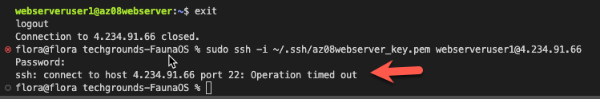

# [Firewalls]
Sinds alle bronnen in de cloud altijd online staan, is het belangrijk om deze te beveiligen tegen bedoeld en onbedoeld schadelijk verkeer. Azure Firewall kan VNets beschermen tegen dit verkeer.

## Key-terms
Azure Firewall
VNets
IP
Stateless
Stateful
NSG

## Study

## Opdracht
- We gaan beginnen met het aanmaken van een nieuwe vm met webserver custom data
~~~
#!/bin/bash
sudo su
apt update
apt install apache2 -y
ufw allow 'Apache'
systemctl enable apache2
systemctl restart apache2
~~~
- Webserver werk

- NSG ssh block rule

- ssh blocked

- nu voor de zekerheid gaan we hem weer open zetten en de http blokkeren zodat we zeker weten dat we de opdracht goed hebben gedaan
- Nu werkt ssh en http niet dus de NSG firewall werk

### Gebruikte bronnen
[Plaats hier de bronnen die je hebt gebruikt.]

### Ervaren problemen
[Geef een korte beschrijving van de problemen waar je tegenaan bent gelopen met je gevonden oplossing.]

### Resultaat
[Omschrijf hoe je weet dat je opdracht gelukt is (gebruik screenshots waar nodig).]
