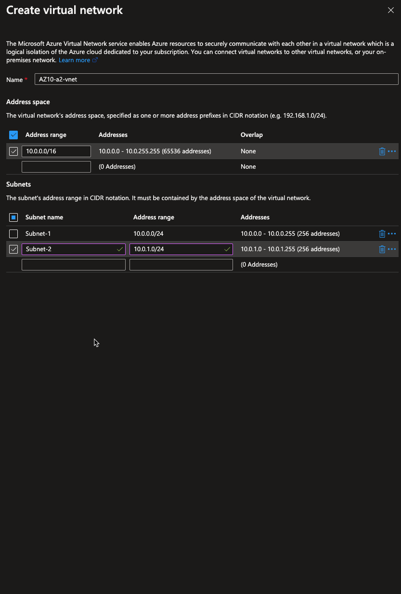
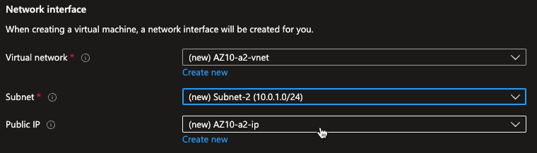

# Azure Virtual Network (VNet)
Azure virtual networks (VNets) zorgen ervoor dat resources als VMs, web apps en databases kunnen communiceren met elkaar, met gebruikers op het internet en met machines die on-premises staan.

## Key-terms
Vnet
VPNs
UDR

## **Computational Thinking:**

1. **Understand the Problem:**  
   1. Identify the problem or task at hand.
   Creating a Vnet and a webserver vm
   2. Gather relevant information and requirements.  
      - Point to site VPNs
      - Site to site VPNs
      - Azure Expressroute
2. **Problem Decomposition:**  
   3. Break down the problem into smaller, manageable components.
- virtual network
- vpn gateway
- local network gateway
   4. Identify the steps or subtasks needed to solve each component.
Find good information (MSlearn + Youtube + Google + ChatGPT)
3. **Pattern Recognition:**  
   5. Analyze patterns or similarities in the data or problem.
   6. Identify recurring structures or relationships.

4. **Abstraction:**  
   7. Identify the essential characteristics or properties relevant to the problem.
   - Security pillar  
   8. Remove unnecessary details and focus on the core concepts.
   - Security --> creating data tunnels and or walls around your

5. **Algorithmic Design:**  
   9. Define the steps or subtasks required to solve the problem.  
   10. Determine the order and dependencies of the steps.  
   11. Plan for inputs and outputs.  

## Opdracht
## Maak een Virtual Network met de volgende vereisten:
Region: West Europe
Name: Lab-VNet
IP range: 10.0.0.0/16
Vereisten voor subnet 1:
Name: Subnet-1
IP Range: 10.0.0.0/24
Dit subnet mag geen route naar het internet hebben
Vereisten voor subnet 2:
Name: Subnet-2
IP Range: 10.0.1.0/24

- We gaan eerst beginnen met het aanmaken van een virtual network omdat dit de 2de keer is dat ik aan de opdracht begin weet ik dat we uiteindelijk om ons virtual network aan de VM in opdracht 2 te koppelen we een NAT gateway moeten gebruiken.

- Hierdoor kunnen we ook via de Vnet die bij de VM komt onze subnets creeren.
- Dit gaan we doen bij opdracht 2

## Opdracht 2:
Maak een VM met de volgende vereisten:
Een apache server moet met de volgende custom data geïnstalleerd worden:

~~~
#!/bin/bash
sudo su
apt update
apt install apache2 -y
ufw allow 'Apache'
systemctl enable apache2
systemctl restart apache2
~~~

Er is geen SSH access nodig, wel HTTP  
Subnet: Subnet-2  
Public IP: Enabled  
Controleer of je website bereikbaar is  

Bij het aanmaken van de VM creeren we een nieuwe virtual network en dat geeft ons de optie om 2 subnets aan te maken.
Create Virtual Network.

Vervolgens selecteren we ons aangemaakte subnet -> Subnet-2

Nu moeten we nog de naam van onze Vnet aanpassen zoals aangegeven in opdracht 1
We kunnen de naam niet aanpassen, we moeten een nieuw Vnet aanmaken zoals bij opdracht 1 dus dit gaan we doen.

We gaan nu een NAT gateway aanmaken en daarbij direct een Vnet

### Gebruikte bronnen
https://learn.microsoft.com/en-us/azure/vpn-gateway/tutorial-site-to-site-portal
https://www.youtube.com/watch?v=CWy3x3Wux6o
https://learn.microsoft.com/en-us/answers/questions/1121759/renaming-virtual-network
https://www.youtube.com/watch?v=yghrkFzaYTU

### Ervaren problemen
[Geef een korte beschrijving van de problemen waar je tegenaan bent gelopen met je gevonden oplossing.]

### Resultaat
[Omschrijf hoe je weet dat je opdracht gelukt is (gebruik screenshots waar nodig).]

