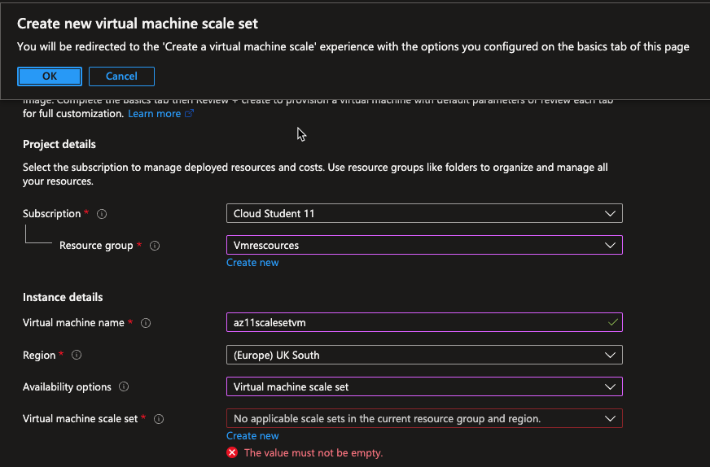
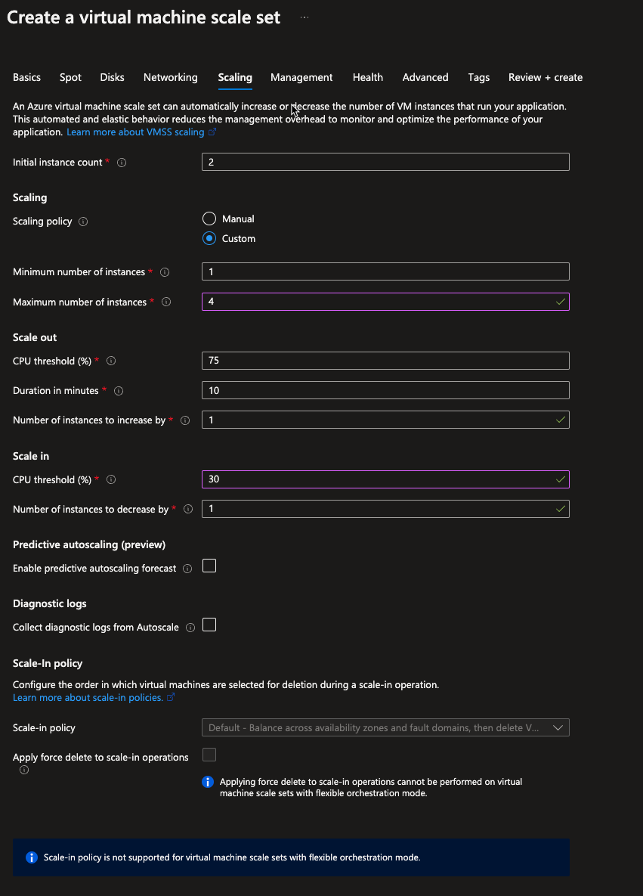
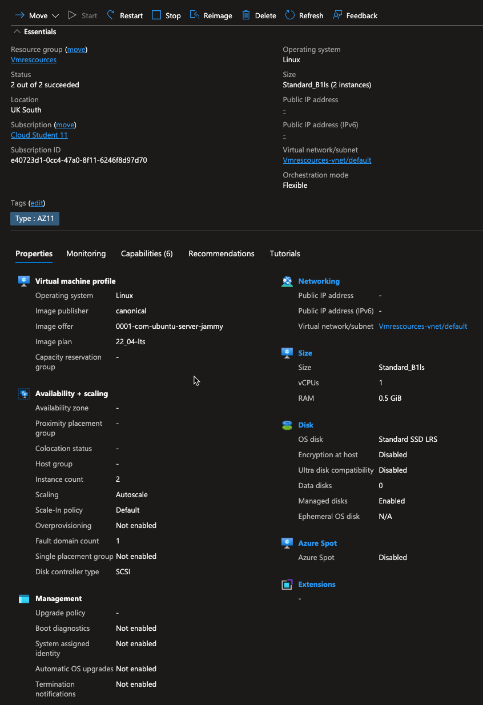
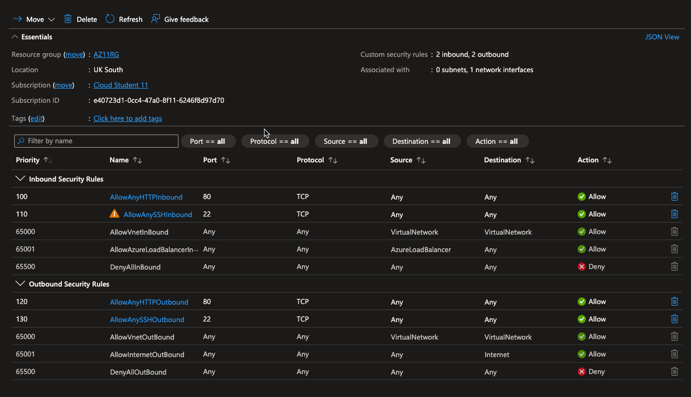
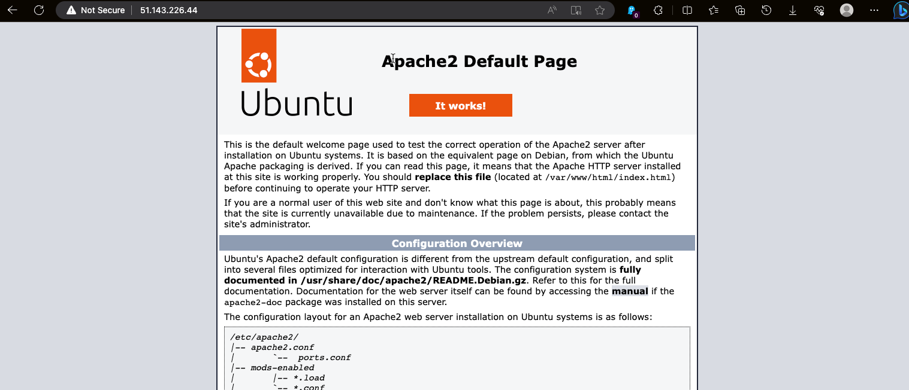
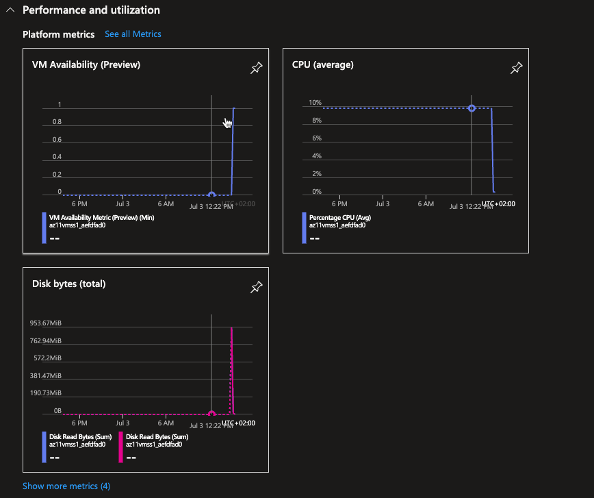
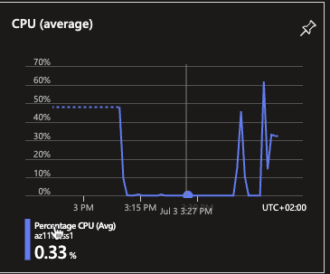
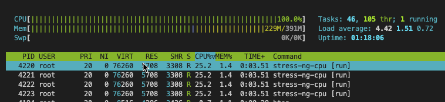
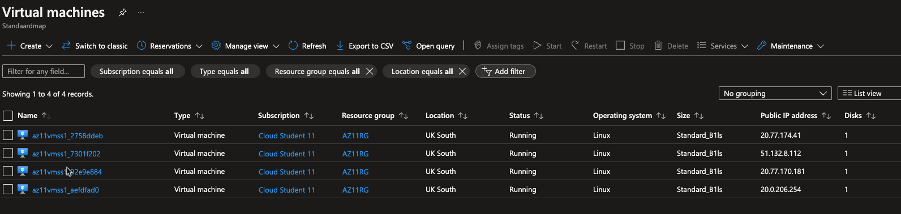

# [Azure Load Balancer (ALB) & Auto Scaling]
Een van de grootste voordelen van de cloud is dat je niet hoeft te gokken hoeveel capaciteit je nodig hebt. Je kan altijd up en down schalen met on-demand services. Een van de services die dit mogelijk maakt heet Autoscaling.

## Key-terms
Autoscaling

# Opdracht
## Opdracht 1:

# Sessie 1
- Maak een Virtual Machine Scale Set met de volgende vereisten:
    - Ubuntu Server 20.04 LTS - Gen1
        - Size: Standard_B1ls
        - Allowed inbound ports:
            - SSH (22)
            - HTTP (80)
        - OS Disk type: Standard SSD
    - Networking: defaults
    - Boot diagnostics zijn niet nodig
    - Custom data:
~~~
#!/bin/bash
sudo su
apt update
apt install apache2 -y
ufw allow 'Apache'
systemctl enable apache2
systemctl restart apache2
~~~

- Initial Instance Count: 2
- Scaling Policy: Custom
        - Aantal VMs: minimaal 1 en maximaal 4
- Voeg een VM toe bij 75% CPU gebruik
- Verwijder een VM bij 30% CPU gebruik

---
### Notes(1) 
- Om te beginnen met deze opdracht gaan we opzoeken wat een virtual machine scla eset is en hoe we deze kunnen opstarten.
- Ik heb hiervoor de volgende stappen gevonden.
### STEPS  
---

1. In the Azure portal search bar, search for and select Virtual Machine Scale Sets.
2. Select Create on the Virtual Machine Scale Sets page.
3. In the Basics tab, under Project details, make sure the correct subscription is selected and create a new resource group called myVMSSResourceGroup.
4. In Region, select a region that is close to your area.
5. Under Orchestration, ensure the Uniform option is selected for Orchestration mode.
6. Select a marketplace image for Image.
7. Enter your desired username, and select which authentication type you prefer.
---
Notes(2)
- bij availabillity options kies ik voor virtual machine scale set 
- Dan kiezen we de gen1 ubuntu server vm
- Standard_B1ls
- HTTP + SSH inbound ports
- Standard SSD disk
- Ik zie hier de load balancing option dus ik ben benieuwd of we hier later wat mee gaan doen.

- Boot diagnostics zijn niet nodig dus die gaan op disable
- Dan vullen we de custom data in
~~~
#!/bin/bash
sudo su
apt update
apt install apache2 -y
ufw allow 'Apache'
systemctl enable apache2
systemctl restart apache2
~~~
- Nu komt er een stukje waar ik even moet kijken wat het precies betekend
- Het blijkt dat ik bij Basic iets niet goed heb ingevoerd namelijk de virtual machine scale set deze moet ik aanmaken

- Dit gaan we nu doen.
- In het scaleset menu zien veel dingen er net anders uit zoals de load balancing options toch laten we dit even voor wat het is en gaan verder met het aanmaken.
- We zijn nu aangekomen bij het tab scaling
- Hier kiezen we voor een Custom Scaling policy
- We veranderen die opgegeven settings in de opdracht.

- Wederom bootdiag disable
- Wederom Custom data
~~~
#!/bin/bash
sudo su
apt update
apt install apache2 -y
ufw allow 'Apache'
systemctl enable apache2
systemctl restart apache2
~~~
- We lopen nog een keer de instellingen na.

- --> Create
- We hebben nu een scaleset gemaakt

- Toch vraag ik me af waarom de guide zegt dat we een loadbalancer moeten creeren maar daar in de opdracht niets over staat, als ik bij opdracht 2 kijk kom ik dat toch wel weer tegen.
### Scource:
https://learn.microsoft.com/en-us/azure/virtual-machine-scale-sets/quick-create-portal

- Ik ga dit straks vragen aan mijn collega's
- Tijd om loadbalancer dieper te onderzoeken

# Sessie 2

- We gaan nu beginnen met het aanmaken van een loadbalancer en daarbij zorgen we ook voor een frontend IP en een backendpool
- De backend pool geeft aan welke vms verbonden zijn aan de loadbalancer
- de frontendip geeft aan wat ons IP is 

- We gaan nu de firewall open zetten voor de 2 poorten 22 en 80 ssh en http

- als we nu naar de ip van onze vm gaan komen we uit bij de webserver
- of dit nu via mijn loadbalancer gaat is mij niet duidelijk
- Het ip van de loadbalancer is 
~~~
51.143.226.44 (az11publicip)
~~~
Na het instellen van onze loadbalancer met een port 80 allow rule kunnen we via het loadbalancer public ip adress inloggen op onze apache webserver

---

## Opdracht 2:
## ontroleer of je via het endpoint van je load balancer bij de webserver kan komen.
- Het ip van de loadbalancer is 
~~~
51.143.226.44 (az11publicip)
~~~
Na het instellen van onze loadbalancer met een port 80 allow rule 

kunnen we via het loadbalancer public ip adress inloggen op onze apache webserver

## Voer een load test uit op je server(s) om auto scaling the activeren. Er kan een delay zitten in het creëren van nieuwe VMs, afhankelijk van de settings in je VM Scale Set.
- Van uit rescources gaan we zoeken naar azure load testing.
- we kiezen voor azure load testing
- 50 gebruikers met op ip http://51.143.226.44/ (onze webserver)
- we hebben onze rescource group toegevoegd en gaan nu kijken of we een load test kunnen uitvoeren.
- 
- De test leek niet genoeg om onze vm scaleset te activeren
- nu gaan we het proberen met 100 gebruikers
- Ook lijkt 100 niet genoeg om 75% cpu te triggeren

- 2500 ook niet dus we moeten via ssh gaan inloggen om een stress test te gaan doen
- Daarvoor moet ik nog even poort 22 open zetten
- We gaan direct op de vm inloggen dus niet via de loadbalancer onze ssh verbinding starten en hebben we dus het volgende ip nodig 
~~~
 sudo ssh -i ~/.ssh/az11vmuser1@20.0.206.254 
~~~
Nu gaan we een stress test uitvoeren via onze linux vm met het programma stress

sudo apt-get update
sudo apt-get install stress

nu gaan we de cpu stressen met de volgende command
~~~
sudo stress-ng --cpu 4 --timeout 600
~~~
- we openen ook een 2de terminal windows om via `htop` onze rescources te zien

- Het is gelukt

- Zelfs met 4 vm

----

### Gebruikte bronnen

https://learn.microsoft.com/en-us/azure/virtual-machine-scale-sets/flexible-virtual-machine-scale-sets-portal)¹.

(1) Quickstart - Create a Virtual Machine Scale Set in the Azure portal .... https://learn.microsoft.com/en-us/azure/virtual-machine-scale-sets/quick-create-portal.
(2) Create virtual machines in a scale set using Azure portal. https://learn.microsoft.com/en-us/azure/virtual-machine-scale-sets/flexible-virtual-machine-scale-sets-portal.

Load balancer
https://learn.microsoft.com/en-us/azure/load-balancer/components

Public Load Balancer
https://learn.microsoft.com/en-us/azure/load-balancer/quickstart-load-balancer-standard-public-portal

Stress test
https://www.tecmint.com/linux-cpu-load-stress-test-with-stress-ng-tool/

### Ervaren problemen
[Geef een korte beschrijving van de problemen waar je tegenaan bent gelopen met je gevonden oplossing.]

### Resultaat
[Omschrijf hoe je weet dat je opdracht gelukt is (gebruik screenshots waar nodig).]

### Notes to self
- Delete all je rescources en groups voordat je aan een nieuwe dag begint.

