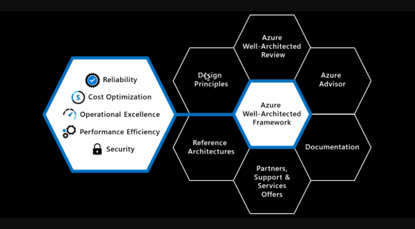
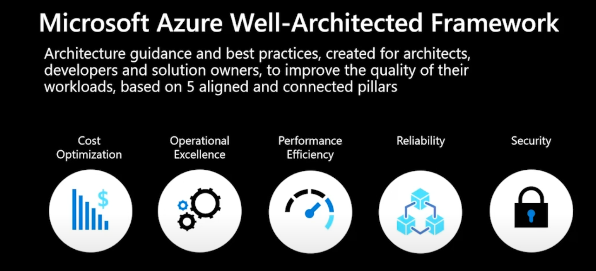
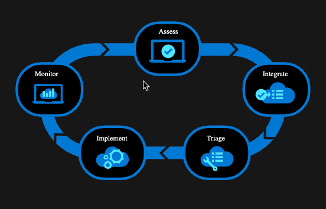

# Well-Architected Framework
Well-Architected Framework

## Introductie:  
De Cloud Providers hebben er baat bij dat hun klanten goede, veilige applicaties op de infrastructuur van de provider draaien. Om klanten een leidraad te geven hoe een goede, veilige applicatie eruit ziet is het Well-Architected Framework in het leven geroepen.

Het Well-Architected Framework van Azure en AWS lijken veel op elkaar.  
Ze zijn gebaseerd op bijna dezelfde ‘pilaren’, namelijk:  
- Reliability  
- Security  
- Cost Optimization  
- Operational Excellence  
- Performance Efficiency  

Een ezelsbruggetje om deze pilaren te kunnen onthouden is ook wel CROPS.

Elke pilaar gaat in op een aspect van je applicatie, en hoe de Cloud kan helpen deze te optimaliseren.

Jij, als cloud engineer, moet met deze Well-Architected Framework een applicatie kunnen bouwen die optimaal gebruik maakt van de mogelijkheden in de Cloud.

## Key-terms

# Bestudeer:
## Well-Architected Framework van Azure
- Om dit topic te bestuderen gaan we onszelf een paar vragen stellen en hopelijk door deze te beantwoorden leren we over well archtected framework van Azure
## 1. Wat is Well architected framework?
Het Azure Well-Architected Framework is een set richtlijnen die u kunt gebruiken om de kwaliteit van een workload te verbeteren.

Zoals je ziet is het Azure Well-Architected Framework onderdeel van een groter netwerk

### Het framework bestaat uit vijf pijlers van uitstekende architectuur:
1. **Security:** Security is typically considered the top priority in any system architecture. Protecting data, systems, and assets from unauthorized access, threats, and breaches is crucial for maintaining trust, compliance, and the overall integrity of the system.

**Reliability:** Reliability is highly important as it ensures that systems can withstand failures and disruptions, and continue to operate as expected. Achieving high availability, fault tolerance, and effective disaster recovery mechanisms are essential for meeting business and customer expectations.

**Operational Excellence:** Operational excellence focuses on efficient and effective management, automation, and optimization of system operations. It enables organizations to deliver value consistently, minimize downtime, and streamline processes, resulting in improved overall performance.

**Performance Efficiency:** Performance efficiency ensures that computing resources are used efficiently to meet system requirements and deliver optimal performance. Optimizing resource utilization, monitoring performance, and making appropriate architectural choices contribute to a highly efficient and responsive system.

**Cost Optimization:** While cost optimization is important, it is typically considered a secondary consideration after addressing the other pillars. It involves managing and optimizing costs while still meeting the desired system objectives. This includes monitoring expenses, eliminating waste, and making cost-effective decisions without compromising the other pillars.

---

## 2. How to Implement Each Pillar with Cloud Services

1. **Assess**: Evaluate the current state of the system in relation to the specific pillar. Identify strengths, weaknesses, and areas of improvement. Assess the existing architecture, processes, and technologies in place.

2. **Integrate**: Integrate cloud services and features that align with the pillar's objectives. Leverage the capabilities provided by the cloud platform to enhance the desired attribute of the system. This may involve configuring security controls, setting up redundancy and failover mechanisms, implementing automation, or utilizing performance optimization tools.

3. **Triage**: Prioritize and address issues or gaps identified during the assessment phase. Identify critical areas that require immediate attention and develop action plans to resolve them. Implement corrective measures to align the system with the desired pillar.

4. **Implement**: Execute the planned changes and improvements to the system architecture and processes. Deploy the necessary cloud services, configure them according to best practices, and integrate them into the system. This may involve designing and implementing security measures, setting up monitoring and alerting systems, optimizing resource usage, or implementing disaster recovery mechanisms.

5. **Monitor**: Continuously monitor the system's performance, adherence to the pillar's objectives, and identify any deviations or potential issues. Utilize monitoring tools and services provided by the cloud platform to track relevant metrics, analyze logs, and generate actionable insights. Regularly review and update the implemented solutions to ensure ongoing alignment with the pillar's requirements.

By following this implementation process, organizations can leverage the capabilities offered by cloud services to enhance each pillar of the Well-Architected Framework. It enables the integration of best practices and cloud-native features to build robust, secure, efficient, reliable, and cost-effective systems.

## 3. We gaan nu wat videos kijken die gaan over het well architected framework

----
1 uur video van microsoft:
Use the Azure Well Architected Framework to optimize your … - https://www.youtube.com/watch?v=CzIZ9GqX6KE3

Hier heb ik het volgende uit gehaald

**How to Use the Well-Architected Methodology:**

1. **Review** the Well-Architected Framework: Familiarize yourself with the five pillars of the framework: Operational Excellence, Security, Reliability, Performance Efficiency, and Cost Optimization. Understand the principles and best practices associated with each pillar.

2. **Assess** your current architecture: Evaluate your existing Azure environment against each of the well-architected pillars. Identify areas where improvements can be made in terms of availability, resilience, cost-effectiveness, security, and operational efficiency.

3. **Define** goals and requirements: Based on the assessment, define specific goals and requirements for your Azure solutions. Determine the level of availability, resilience, cost optimization, security, and operational efficiency you want to achieve.

4. **Architect** for high availability: Design your solutions to minimize downtime and ensure continuous availability. Utilize Azure's built-in features like availability sets, virtual machine scale sets, and load balancers to distribute workloads and handle failures.

5. **Ensure** reliability: Implement measures to enhance the reliability of your solutions. This may include implementing redundancy, fault tolerance, automated monitoring and alerting, and disaster recovery mechanisms.

6. **Optimize** costs: Continuously monitor and optimize your Azure costs. Leverage tools like Azure Cost Management + Billing and Azure Advisor to gain insights into spending, identify cost-saving opportunities, and implement cost optimization strategies such as reserved instances, spot instances, and rightsizing.

7. **Enhance** security: Implement robust security measures to protect your Azure resources and data. Utilize Azure's security features such as Azure Active Directory, Azure Security Center, and Azure Firewall. Follow best practices for identity and access management, network security, data encryption, and threat detection and response.

8. **Improve** operational efficiency: Streamline operations and improve efficiency by automating tasks, utilizing infrastructure as code, implementing DevOps practices, and leveraging Azure's management and monitoring tools. Consider using Azure Resource Manager templates, Azure Automation, Azure Monitor, and Azure Log Analytics.

9. **Continuously** iterate and improve: Regularly assess and refine your Azure solutions based on changing requirements, technology advancements, and feedback from stakeholders. Monitor key performance indicators, gather insights from Azure monitoring and analytics, and incorporate lessons learned to drive continuous improvement.

By following the well-architected methodology, you can ensure that your Azure solutions are designed and implemented to be highly available, resilient, cost-effective, secure, and operationally efficient. Regularly reassessing and optimizing your architecture will help you maintain these qualities as your environment evolves over time.

----
## Extra videos
Playlist:   
Azure Well-Architected - https://www.youtube.com/playlist?list=PLlrxD0HtieHjThIheXKKON1YJA2K2uE-P1

Microsoft Azure Well-Architected Framework - https://www.youtube.com/watch?v=dT233xJ3xPs2

### Gebruikte bronnen
https://learn.microsoft.com/nl-nl/azure/well-architected/

https://learn.microsoft.com/nl-nl/azure/well-architected/

https://learn.microsoft.com/nl-nl/azure/well-architected/implementing-recommendations

### Ervaren problemen
Ik ben niet echt tegen problemen aangelopen met deze opdracht er is wel ontzettend veel over te vinden en het lijkt een topic dat echt helpt met het grotere plaatje, erg intressant allemaal.

Voor nu heb ik het onderwerp vooral gedecomposeerd in bronnen videos en termen.

Later ga ik hier goed voor zitten en naar de videos luisteren.

