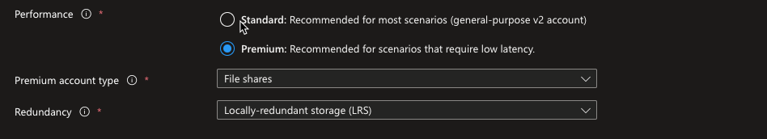
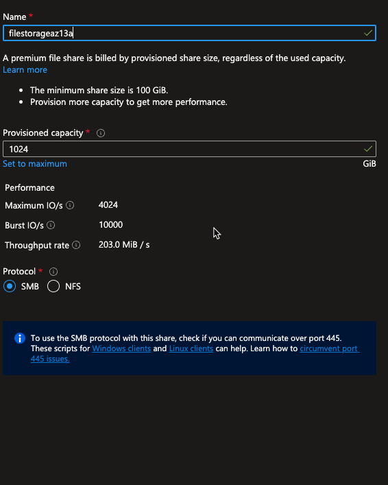
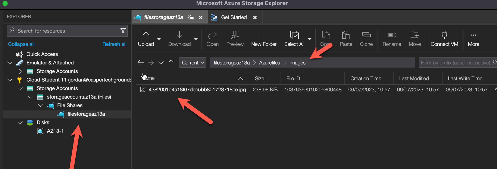

# [Azure Files]
Azure Files offers fully managed file shares in the cloud that are accessible via the industry standard Server Message Block (SMB) protocol, Network File System (NFS) protocol, and Azure Files REST API.

Azure file shares can be mounted concurrently by cloud or on-premises deployments.

SMB Azure file shares are accessible from Windows, Linux, and macOS clients. NFS Azure file shares are accessible from Linux clients.

Additionally, SMB Azure file shares can be cached on Windows servers with Azure File Sync for fast access near where the data is being used.

---

## Key-terms
    - SMB (Server Message Block)
    - NFS (Network File System)
    - Azure Files REST API.
    - System I/O APIs
    - Azure Storage Client Libraries    
---

## Study

### Waar zijn azure files voor?
- Replace or supplement on-premises file servers
- Life and shift applications
- Simplify cloud development
    - Shared application settings
    - Diagnostic share
    - Dev/Test/Debug
- Containerization

### Hoe past Azure Files / vervangt Azure Files in een on-premises setting?
Azure files vervangen traditionele on premisis file server of network-attached storage (NAS) Devices.
Populaire OS zoals Windows MACOS en linux kunnen Azure files shares mounten op elke locatie van de wereld met een internet verbinding.
Je kan AD DS gebruiken voor acces control van bestanden on premises.

### Hoe kan ik Azure Files combineren met andere diensten?
- Je kan dit doen door middel van 
    - SMB (Server Message Block)
    - NFS (Network File System)
    - Azure Files REST API.

### Wat is het verschil tussen Azure Files en andere gelijksoortige diensten?
- East to use
Je hoeft niets speciaals te doen je kan azure files zo op je pc mounten.
- Shared Acces
Via SMB en NFS protocols kan je makkelijk bestanden delen of samen gebruiken. Dit over meerdere systemen en computers.
- Fully Managed
Je hebt niet te maken met hardware of OS updates en andere zaken die Azure files in functie zouden kunnen belemmeren.
- Scripting and tooling.
Met Powershell en Azure CLI kan je azure files createn mounten en managen als onderdeel van admin applicaties, denk hierbij aan azure storage explorer.
- Resilliency
Je heb niet te maken met netwerk of stroom uitval
- Programmability
Via verschillende API's en Libraries kan je applicaties die in azure runnen voorzien van Azure files en heb je toegang tot deze data om te delen.
- System I/O APIs
- Azure Storage Client Libraries
- Azure Files REST API

---

## Opdracht

### Waar kan ik deze dienst vinden in de console en hoe zet ik deze aan?
- we moeten hiervoor een storage account maken.

Network Considerations
https://learn.microsoft.com/en-us/azure/storage/files/storage-files-networking-overview

- Nu we een storage account hebben gemaakt gaan we data storage maken met het SMB protocol

- We kunnen niet bij onze filestorage door de firewall dus we gaan onze client ip toevoegen vanuit de storage account

### Hoe kan ik deze dienst koppelen aan andere resources?
- Virtual Machines
binnen een VM dan kunnen we de folder mounten aan onze VM via het SMB protocol
https://learn.microsoft.com/en-us/azure/storage/files/storage-how-to-use-files-linux?tabs=Ubuntu%2Csmb311

- Azure Storage Explorer
    - Hier hebben we een folder aangemaakt en een image geupload
    - 
- Mount to MacOS finder
https://learn.microsoft.com/en-us/azure/storage/files/storage-how-to-use-files-mac

### Gebruikte bronnen
MS Learn     
https://learn.microsoft.com/en-us/azure/storage/files/storage-files-introduction  
MS training  
https://learn.microsoft.com/en-us/training/modules/introduction-to-azure-files/
MS training 2  
https://learn.microsoft.com/en-us/training/modules/configure-azure-files-file-sync/
Azure Files Service  
https://www.youtube.com/watch?v=BCzeb0IAy2k&t=796s
Network considerations
https://learn.microsoft.com/en-us/azure/storage/files/storage-files-networking-overview

### Ervaren problemen
[Geef een korte beschrijving van de problemen waar je tegenaan bent gelopen met je gevonden oplossing.]

### Resultaat
[Omschrijf hoe je weet dat je opdracht gelukt is (gebruik screenshots waar nodig).]
