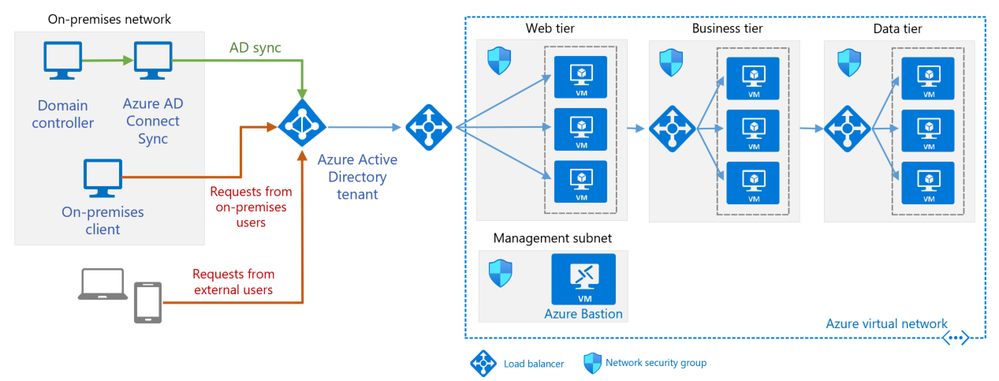
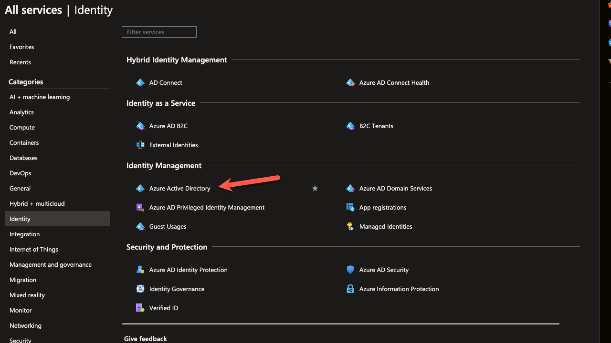

# [Onderwerp]
Azure Active Directory (Azure AD) is a cloud-based multi-tenant directory and identity service.

---

## Key-terms
[Schrijf hier een lijst met belangrijke termen met eventueel een korte uitleg.]

---

## Study
[]
### Waar is X voor?
Azure Active Directory is a service for managing user accounts privileges and access
### Hoe past X / vervangt X in een on-premises setting?
- Location
Installed and runs on your own servers within your organization's premises or data centers
- Control
You have full controll and responsibility for managing and maintaining the infrastructure hardware and software
- Functionality
You have all futures like : user authentication authorization and rescources acces control within your onpremises network
- Integration
It integrates with onpremises applications services and systems

When it comes to Azure AD on premises and Azure AD in the cloud there are some key differences
- Location
Cloud vs on-premises 
- Management
Microsoft vs self
- Scalabillity
Advantages of the cloud vs limitations of on-premises

---
### Hoe kan ik X combineren met andere diensten?
- Archetecture

- Components
**Azure AD tenant.** An instance of Azure AD created by your organization. It acts as a directory service for cloud applications by storing objects copied from the on-premises Active Directory and provides identity services.

**Web tier subnet.** This subnet holds VMs that run a web application. Azure AD can act as an identity broker for this application.

**On-premises AD DS server.** An on-premises directory and identity service. The AD DS directory can be synchronized with Azure AD to enable it to authenticate on-premises users.

**Azure AD Connect sync server.** An on-premises computer that runs the Azure AD Connect sync service. This service synchronizes information held in the on-premises Active Directory to Azure AD. For example, if you provision or deprovision groups and users on-premises, these changes propagate to Azure AD.

### Applications

**Registering the application**  
    To use Azure AD with an application, you first need to register the application in Azure AD. This involves creating an application registration in your Azure AD tenant. During registration, you specify important details about the application, such as its name, redirect URLs (where users should be redirected after authentication), and the permissions it requires.

**Configuring authentication**  
    Once the application is registered, you need to configure how the application authenticates users. Azure AD supports various authentication protocols like OAuth 2.0 and OpenID Connect. You can choose the appropriate protocol based on your application's requirements. Azure AD provides configuration options to enable single sign-on (SSO) and specify the level of authentication required, such as username/password, multi-factor authentication, or federated authentication with external identity providers.

**Authorization and permissions**
    Azure AD allows you to define fine-grained access controls for applications using Azure AD's role-based access control (RBAC) capabilities. You can configure which users or groups have access to the application and specify the permissions they are granted. This ensures that users can only access the application features and data they are authorized to use.

**Integrating application code**  
    Once the application is registered and the authentication and authorization settings are configured, you need to integrate the Azure AD authentication code into your application. This typically involves using Azure AD SDKs, libraries, or APIs provided by Microsoft to handle the authentication process. The integration code handles the authentication flow, user token acquisition, and validation against Azure AD.

**User authentication and access**
    When users interact with the application, they are redirected to the Azure AD sign-in page for authentication. After successful authentication, Azure AD issues a token to the application, which can be used to validate the user's identity and authorization when accessing protected resources or performing actions within the application.

**Secure application access**
    Azure AD provides additional security features like conditional access policies, which can be used to enforce specific access controls based on various conditions such as user location, device compliance, or risk level. This helps ensure that application access remains secure and aligned with organizational policies.

### Wat is het verschil tussen X en andere gelijksoortige diensten?

---

## Opdracht

### Waar kan ik deze dienst vinden in de console?

### Hoe zet ik deze dienst aan?
1. Sign in to the Azure portal
2. Create a managed domain
3. Deploy the managed domain
4. Update DNS settings for the Azure virtual network
5. Enable user accounts for Azure AD DS
6. Link with apps and services you want to use Azure AD with.

### Hoe kan ik deze dienst koppelen aan andere resources?

**Azure Active Directory:**

| Step | Concept | Learning Resources | Assignment |
|------|---------|--------------------|------------|
| 1    | Introduction to Azure Active Directory (Azure AD) | Azure AD is a cloud-based identity and access management service that provides authentication and authorization for applications and resources in Azure. It enables single sign-on, multi-factor authentication, and more. | - Microsoft Learn: [Introduction to Azure Active Directory](https://docs.microsoft.com/en-us/learn/modules/intro-to-azure-ad/) | Set up Azure AD and create a user account. Explore different authentication methods, such as password-based, MFA, or Azure AD B2B guest user. |
| 2    | Application and Service Principal Objects | Understand the concepts of application and service principal objects in Azure AD. They are used to authenticate and authorize applications and services to access resources in Azure. | - Microsoft Learn: [Use Azure Active Directory service principals & managed identities](https://learn.microsoft.com/en-us/azure/devops/integrate/get-started/authentication/service-principal-managed-identity?view=azure-devops) | Register an application in Azure AD and configure its permissions. Create a service principal and assign it appropriate roles and permissions. |
| 3    | Azure AD Authentication and Authorization | Learn about different authentication and authorization methods in Azure AD, such as OAuth, OpenID Connect, and role-based access control (RBAC). Understand how to secure access to Azure resources using Azure AD. | - Microsoft Learn: [Secure Azure resources with Azure Active Directory](https://docs.microsoft.com/en-us/learn/modules/secure-azure-resources-with-azure-ad/) | Configure RBAC roles for Azure resources and assign them to users or groups in Azure AD. Implement Azure AD-based authentication for an application or API. |

### Gebruikte bronnen
On-Prem AD vs. Hybrid Azure AD Join vs. Azure AD: Key Differences  
https://www.spiceworks.com/tech/cloud/articles/legacy-ad-hybrid-ad-and-azure-ad-difference/

Azure AD Overview MS Learn  
https://learn.microsoft.com/en-us/azure/active-directory-domain-services/overview

Create and configure Azure AD  
https://learn.microsoft.com/en-us/azure/active-directory-domain-services/tutorial-create-instance

Steps to integrate your apps  
https://learn.microsoft.com/en-us/azure/active-directory/fundamentals/five-steps-to-full-application-integration

### Videos
Adam Marczak
https://www.youtube.com/watch?v=Ma7VAQE7ga4

John Savill
https://www.youtube.com/watch?v=EUVKEhiHYG0

MS Learn
https://www.youtube.com/watch?v=T1Nd9APNceQ

### Ervaren problemen
[Geef een korte beschrijving van de problemen waar je tegenaan bent gelopen met je gevonden oplossing.]

### Resultaat
[Omschrijf hoe je weet dat je opdracht gelukt is (gebruik screenshots waar nodig).]
