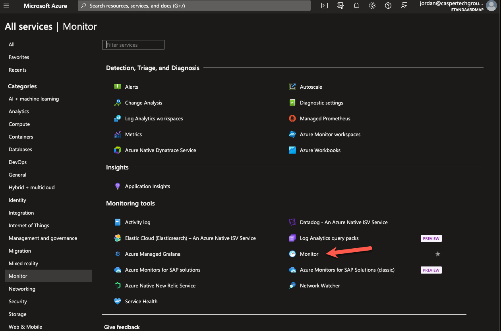

# [Onderwerp]
Vanaf dit moment zullen wij, als learning coaches, jullie minder opdrachten geven. We zullen meer beroep doen op je zelfstandig leervaardigheden. Geen zorgen, je bent niet alleen. Je hebt elkaar en de vaste dagelijkse structuur blijft bestaan waarin je ons nog altijd de oren van ons hoofd kan vragen.

Onderwerpen die je onder de kop “Bestudeer” vindt verwachten wij dat je alleen op een theoretisch niveau hoeft te kennen. Van onderwerpen onder de kop “Opdrachten” moet je ook praktische ervaring opbouwen.

---

## Key-terms
[Schrijf hier een lijst met belangrijke termen met eventueel een korte uitleg.]

R Responsible
A Accountable
C Criteria
I Informed

---

## Study
[]
### Waar is X voor?
Voor het monitoren en inzien of opslaan van rescource data
### Hoe past X / vervangt X in een on-premises setting?
vervangt on premises monitoring tools
### Hoe kan ik X combineren met andere diensten?
Als je een rescource aanmaakt kan je deze automatisch monitoren in azure
### Wat is het verschil tussen X en andere gelijksoortige diensten?
Omdat het onderdeel is van 

---

### Waar kan ik deze dienst vinden in de console?

### Hoe zet ik deze dienst aan?
Deels gaat dit automatisch bij het aanmaken van rescources kan je ook andere tools linken 
### Hoe kan ik deze dienst koppelen aan andere resources?

## Opdracht

**Azure Monitor:**

| Step | Concept | Learning Resources | Assignment |
|------|---------|--------------------|------------|
| 1    | Introduction to Azure Monitor | Azure Monitor provides comprehensive monitoring solutions for Azure resources and applications. It collects and analyzes telemetry data, helps you understand system behavior, and detect and diagnose issues. | - Microsoft Learn: [Introduction to Azure Monitor](https://docs.microsoft.com/en-us/learn/modules/intro-to-azure-monitor/) | Enable Azure Monitor for a resource or application in Azure. Configure metrics and logs collection. Explore the Azure Monitor dashboard and view metrics and logs. |
| 2    | Alerts and Action Groups | Learn how to create alerts in Azure Monitor based on defined conditions. Configure action groups to define who should be notified and how when an alert is triggered. | - Microsoft Learn: [Alerts in Azure Monitor](https://learn.microsoft.com/en-us/training/modules/configure-azure-alerts/) | Create an alert rule for a specific metric or log condition. Configure an action group to send email notifications when the alert is triggered. Test the alert by triggering the condition. |
| 3    | Log Analytics and Application Insights | Explore Log Analytics and Application Insights, which are components of Azure Monitor. Learn how to collect and analyze logs and application telemetry data to gain insights and troubleshoot issues. | - Microsoft Learn: [Analyze your Azure infrastructure by using Azure Monitor logs](https://learn.microsoft.com/en-us/training/modules/analyze-infrastructure-with-azure-monitor-logs/) | Enable Log Analytics for a resource and configure log collection. Use Application Insights to instrument an application and view its telemetry data. |

### Gebruikte bronnen
MS Azure, What is azure monitor
https://www.youtube.com/watch?v=eSutaPE80PM

Azure Application Insights
https://www.youtube.com/watch?v=A0jAeGf2zUQ

Azure Monitor John Savill's
https://www.youtube.com/watch?v=gzBXFnfvoXo

MS Learn Configuring Azure Monitor
https://learn.microsoft.com/en-us/windows-server/storage/storage-spaces/configure-azure-monitor

### Ervaren problemen
[Geef een korte beschrijving van de problemen waar je tegenaan bent gelopen met je gevonden oplossing.]

### Resultaat
[Omschrijf hoe je weet dat je opdracht gelukt is (gebruik screenshots waar nodig).]
