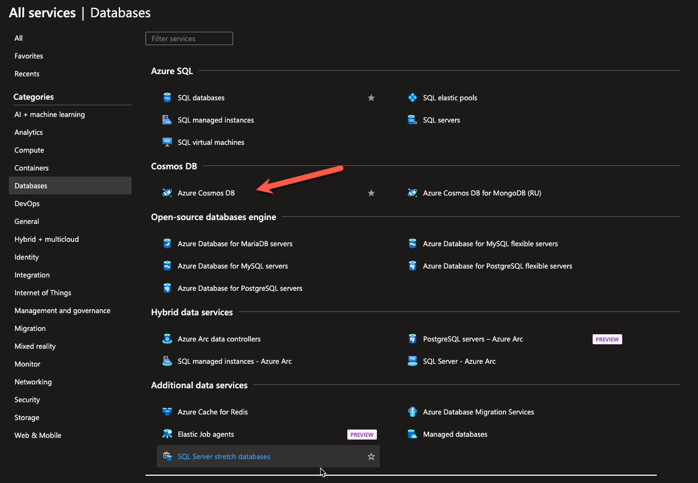

# [Onderwerp]
Vanaf dit moment zullen wij, als learning coaches, jullie minder opdrachten geven. We zullen meer beroep doen op je zelfstandig leervaardigheden. Geen zorgen, je bent niet alleen. Je hebt elkaar en de vaste dagelijkse structuur blijft bestaan waarin je ons nog altijd de oren van ons hoofd kan vragen.

Onderwerpen die je onder de kop “Bestudeer” vindt verwachten wij dat je alleen op een theoretisch niveau hoeft te kennen. Van onderwerpen onder de kop “Opdrachten” moet je ook praktische ervaring opbouwen.

---

## Key-terms
[Schrijf hier een lijst met belangrijke termen met eventueel een korte uitleg.]

---

## Study
[]
### Waar is X voor?
### Hoe past X / vervangt X in een on-premises setting?
### Hoe kan ik X combineren met andere diensten?
### Wat is het verschil tussen X en andere gelijksoortige diensten?

---

## Een handige lijst van taken die je praktisch moet kunnen:
### Waar kan ik deze dienst vinden in de console?

### Hoe zet ik deze dienst aan?
### Hoe kan ik deze dienst koppelen aan andere resources?

## Opdracht

**Cosmos DB:**

| Step | Concept | Learning Resources | Assignment |
|------|---------|--------------------|------------|
| 1    | Introduction to Azure Cosmos DB | Azure Cosmos DB is a globally distributed, multi-model database service that provides high scalability, low latency, and global data distribution. It supports various data models, such as key-value, document, graph, and column-family. | - Microsoft Learn: [Explore fundamentals of Azure Cosmos DB](https://learn.microsoft.com/en-us/training/modules/explore-non-relational-data-stores-azure/) | Create a Cosmos DB account in Azure. Choose a preferred data model and configure it. Create and query data using the Azure portal or the Cosmos DB SDK. |
| 2    | Partitioning and Scaling | Understand the partitioning and scaling concepts in Azure Cosmos DB. Learn how to choose the right partition key and configure the throughput and storage for your database. | - Microsoft Learn: [Partitioning and horizontal scaling in Azure Cosmos DB](https://learn.microsoft.com/en-us/azure/cosmos-db/partitioning-overview) | Design a partitioning strategy for a collection in Cosmos DB. Configure the partition key, throughput, and storage settings. Monitor the performance and scale the database if needed. |
| 3    | Global Distribution and Consistency | Explore the global distribution capabilities of Azure Cosmos DB and learn how to replicate data across multiple regions. Understand the consistency models available in Cosmos DB and their trade-offs. | - Microsoft Learn: [Distribute your data globally with Azure Cosmos DB](https://learn.microsoft.com/en-us/training/modules/global-distribution-and-consistency-azure-cosmos-db/) | Configure the global distribution settings for your Cosmos DB account. Create replicas in different regions and test data synchronization. Experiment with different consistency models and observe their behavior. |

### Gebruikte bronnen
[Plaats hier de bronnen die je hebt gebruikt.]

### Ervaren problemen
[Geef een korte beschrijving van de problemen waar je tegenaan bent gelopen met je gevonden oplossing.]

### Resultaat
[Omschrijf hoe je weet dat je opdracht gelukt is (gebruik screenshots waar nodig).]
