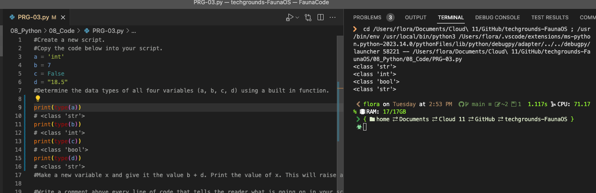
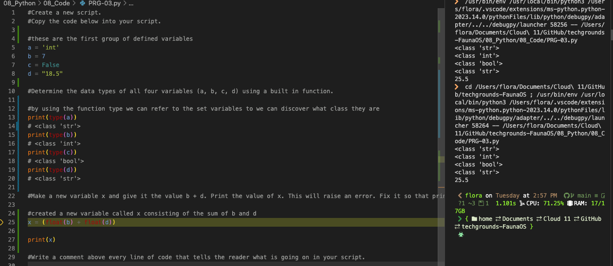

# [Onderwerp]
Under the hood, a computer can only see strings of zeros and ones. Programming languages make use of data types to tell the computer how to interpret those strings.
For example, when the computer needs to read the binary string 01000001, it will need to know the data type to determine whether it means 65 or “A”.

This is a non-exhaustive list of some of the most important data types in Python:
boolean
A binary state that is either True or False.
boolean = True
string
Technically an array of characters. Strings are denoted using “ ” double quotes or ‘ ’ single quotes.
string = "This is a string"
int
An integer is a whole number. Ints can be both positive and negative.
integer = 6
float
A floating-point number is a decimal number.

floating_point = 18.5

Comments are lines that do not get processed as code. This can be used for multiple purposes. For example, you can write a short description of what a block of code does. You can also ‘comment out’ some code, so that it is temporarily removed. This can be useful for testing and debugging.

## Key-terms
[Schrijf hier een lijst met belangrijke termen met eventueel een korte uitleg.]

## Opdracht

# Exercise 1:
* Create a new script.
* Copy the code below into your script.
~~~
a = 'int'
b = 7
c = False
d = "18.5"
~~~
* Determine the data types of all four variables (*a, b, c, d*) using a built in function.

* Make a new variable *x* and give it the value *b + d*. Print the value of *x*. This will raise an error. Fix it so that *print(x)* prints a float.

* Write a comment above every line of code that tells the reader what is going on in your script.
Done see .py file

# Exercise 2:
* Create a new script.
* Use the *input()* function to get input from the user. Store that input in a variable.
* Find out what data type the output of *input()* is. See if it is different for different kinds of input (numbers, words, etc.).

### Gebruikte bronnen
[Plaats hier de bronnen die je hebt gebruikt.]

### Ervaren problemen
[Geef een korte beschrijving van de problemen waar je tegenaan bent gelopen met je gevonden oplossing.]

### Resultaat
[Omschrijf hoe je weet dat je opdracht gelukt is (gebruik screenshots waar nodig).]
