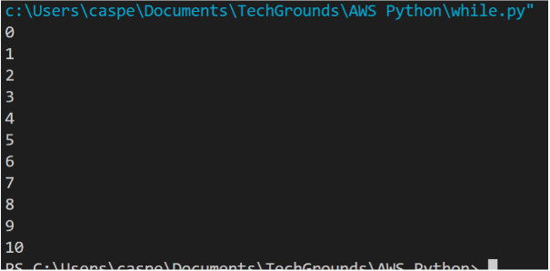
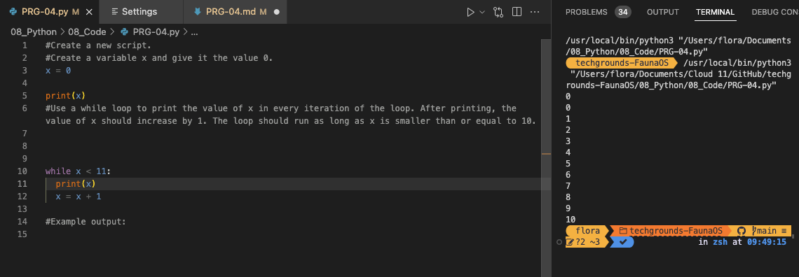
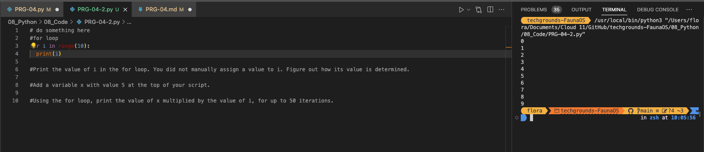
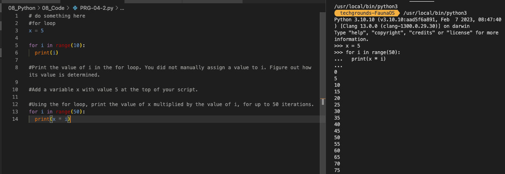
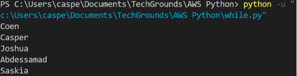

# [Onderwerp]
You can use loops when you want to run a block of code multiple times. For example, you might want to do an operation on every item in a (large) list, or you want to write an algorithm that follows the same set of instructions for multiple iterations.
There are two types of loops in Python: the while loop and the for loop.
The while loop runs while a condition is true. They can run indefinitely if that condition never changes. If your code is stuck in an infinite loop, just press ctrl-c (or command-c on MacOS) to force quit the running code.
The for loop runs for a predetermined number of iterations. This number can be hard coded using the range() function, or dynamically assigned (using a variable, the size of a list, or the number of lines in a document). It is also possible to accidentally create an infinite for loop. You can use the same command (ctrl/cmd+c) to exit your program.

## Key-terms
[Schrijf hier een lijst met belangrijke termen met eventueel een korte uitleg.]

## Opdracht

Create a new script.
Create a variable x and give it the value 0.
Use a while loop to print the value of x in every iteration of the loop. After printing, the value of x should increase by 1. The loop should run as long as x is smaller than or equal to 10.
Example output:

my output

## Exercise 2:

Create a new script.
Copy the code below into your script.
for i in range(10):
	# do something here

Print the value of i in the for loop. You did not manually assign a value to i. Figure out how its value is determined.
Add a variable x with value 5 at the top of your script.
Using the for loop, print the value of x multiplied by the value of i, for up to 50 iterations.

## Exercise 3:
Create a new script.
Copy the array below into your script.
arr = ["Coen", "Casper", "Joshua", "Abdessamad", "Saskia"]
Use a for loop to loop over the array. Print every name individually.
Example output:

### Gebruikte bronnen
https://www.codecademy.com/resources/docs/python/loops

### Ervaren problemen
Geen idee wat indentation was maar het bleek een TAB te zijn waardoor de regel inspringt hiermee geef je aan wat bij de loop hoort

### Resultaat
[Omschrijf hoe je weet dat je opdracht gelukt is (gebruik screenshots waar nodig).]
