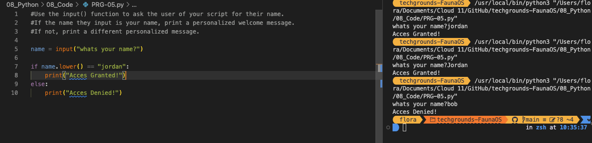

# [Onderwerp]
Very often, you will want to run a piece of code only when certain conditions are met. For example, you might want to write something to an error log only if the reply you receive from a server contains an error.
Python makes use of the if, elif, and else statements.

## Key-terms
[Schrijf hier een lijst met belangrijke termen met eventueel een korte uitleg.]

## Opdracht
## Exercise 1:
Create a new script.
Use the input() function to ask the user of your script for their name. If the name they input is your name, print a personalized welcome message. If not, print a different personalized message.

## Exercise 2:
Create a new script.
Ask the user of your script for a number. Give them a response based on whether the number is higher than, lower than, or equal to 100.
Make the game repeat until the user inputs 100.

### Gebruikte bronnen
https://www.codecademy.com/resources/docs/python/loops
https://www.codecademy.com/resources/docs/python/functions
+ chatGPT for the break function & while true if/else text change

### Ervaren problemen
Ik moet de taal nog leren kennen dus het is soms erg zoeken waarom het niet werkt of wat voor function of naam je nodig hebt zoals, break of elif

### Resultaat
[Omschrijf hoe je weet dat je opdracht gelukt is (gebruik screenshots waar nodig).]
