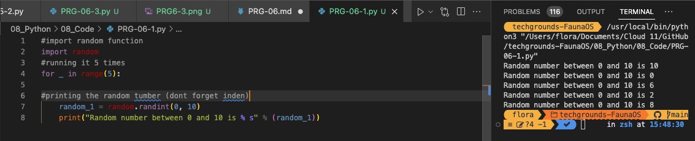
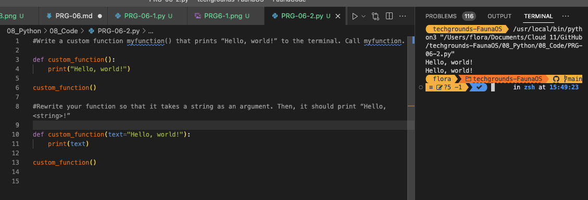
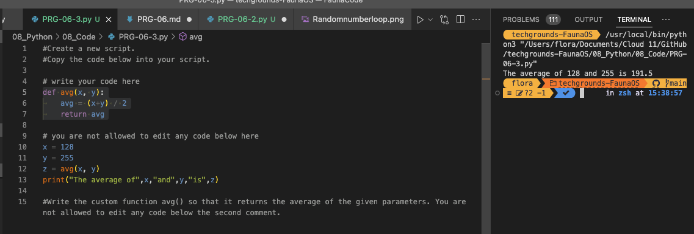

# [Onderwerp]
You’ve already seen and used a couple of functions, like print() and input(). A function is a block of code that only runs when it is called. Functions are recognizable by the brackets () next to the function name. These brackets serve as a place to input data into a function.
Functions return data as a result.

Besides the built-in functions, you can also write custom functions, or import functions from a library or package.

## Key-terms
[Schrijf hier een lijst met belangrijke termen met eventueel een korte uitleg.]

## Opdracht
## Exercise 1:
Create a new script.
Import the random package.
Print 5 random integers with a value between 0 and 100.

  

## Exercise 2:
Create a new script.
Write a custom function myfunction() that prints “Hello, world!” to the terminal. Call myfunction.
Rewrite your function so that it takes a string as an argument. Then, it should print “Hello, <string>!”.

## Exercise 3:
Create a new script.
Copy the code below into your script.
def avg():
	# write your code here

# you are not allowed to edit any code below here
x = 128
y = 255
z = avg(x,y)
print("The average of",x,"and",y,"is",z)
Write the custom function avg() so that it returns the average of the given parameters. You are not allowed to edit any code below the second comment.

### Gebruikte bronnen
Chat GPT prompt
~~~
I want you to act like a python teacher and answer all my questions in a way that i learn the fundamentals. i want you to never give me the answer but ask me questions that lead me to discover the answer myself
~~~
https://www.codecademy.com/resources/docs/python/functions
https://www.geeksforgeeks.org/python-randint-function/

### Ervaren problemen
Bij elke opdracht wel een paar
6-1
6-2
6-3

### Resultaat
[Omschrijf hoe je weet dat je opdracht gelukt is (gebruik screenshots waar nodig).]
